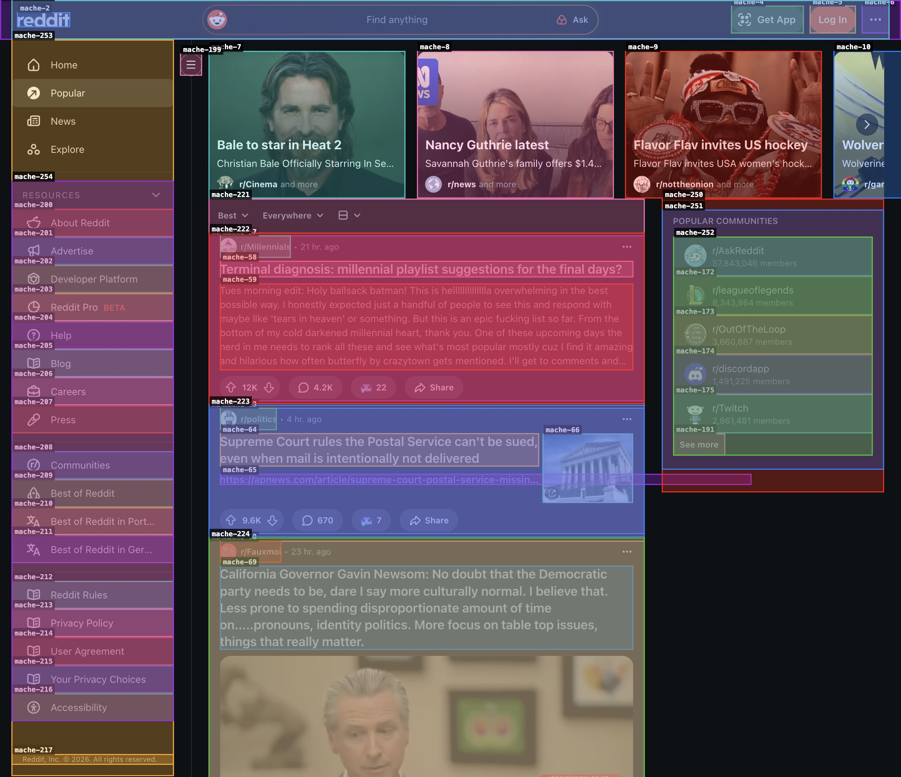

# X-Ray: See Through the Web

> **"Go to Reddit. Click the first post. What's it about?"**
> Three voice commands. Hands-free. The browser just does it.

X-Ray is a voice-driven browser agent that lets you navigate any website by talking to it. A Chrome extension projects the chaotic, modern web — React, SPAs, Shadow DOMs, virtual scroll — into a semantic virtual filesystem. For pixel-rendered content like `<canvas>` and WebGL (Google Maps, Figma, games), a pure-Go Canny edge detection pipeline detects UI regions invisible to DOM parsing. You speak, Gemini Live listens, and a background agent swarm navigates the page in real-time while staying responsive to your voice the entire time.

**Say "click the 5th post." 3.5 seconds later, it's clicked. Two tool calls. Zero pixel guessing.**

---

## Inspiration

I've spent the last year watching AI agents fail at the web — not in interesting ways, but in stupid ways. An agent tries to click a button. It parses 10,000 lines of minified HTML. It guesses a CSS selector. The selector breaks because React re-rendered. The agent retries. Three more wrong guesses. Timeout.

This is the same problem I wrote about in [*The IDE Solved This Twenty Years Ago*](https://jamestexas.medium.com/the-ide-solved-this-twenty-years-ago-876edc7cec76?source=friends_link&sk=524725415db295b95ed414172c0572bc): we keep giving agents raw, unstructured data and wondering why they fail. The IDE solved this for humans twenty years ago — it built a graph-aware layer between the developer and the code. Syntax highlighting, symbol resolution, red squigglies before you save. The filesystem stayed flat, but the *interface* became structured.

The web agent problem is identical. An LLM already knows what a "trending post" *means* (semantics), but when you dump a raw DOM into its context window, it loses all sense of *where* things are and how they relate to each other (topology). Finding a simple link might require navigating `html > body > div[4] > main > shreddit-app > div > div > article:nth-child(5) > shreddit-post > a.block`. Giving an AI tools to find that path is like asking someone to locate a book by reading the library's structural blueprints.

**The thesis**: don't build smarter agents. Build smarter interfaces. Project the complex graph into the medium agents already understand — the filesystem — and even a tiny model can navigate it.

This is [Mache](https://github.com/agentic-research/mache): the Agent-Computer Interface. X-Ray is Mache applied to the web.

---

## What It Does

### Voice-First Browser Navigation

X-Ray turns conversation into browser actions. You talk to your browser like a copilot:

- *"Go to Reddit"* — Chrome navigates, the page is mapped into a filesystem, and the agent confirms: "Done, Reddit is loaded."
- *"Click the first post"* — the agent traverses the filesystem, finds the element, clicks it. "Done, I clicked the first post."
- *"What are you doing?"* — while the agent is working, you can interrupt and ask for a status update: "I'm currently scanning the feed, almost there!"
- *"Actually, switch to my GitHub tab"* — the agent lists your open tabs, finds GitHub, switches to it. No URL needed.
- *"Stop"* — cancels whatever the agent is doing, instantly.

The voice session never blocks. You're always heard, even while the agent is navigating a complex page in the background.

### The Talker/Doer Swarm

This is the core architectural innovation: X-Ray splits voice into **two cooperating agents** that share the same virtual filesystem:

**The Talker** (Gemini Live) is always listening. It has three instant tools — `issue_command`, `check_status`, `cancel_task` — that never block audio. When you say "click the first post," the Talker dispatches the goal and immediately responds: "On it."

**The Doer** (background goroutine) receives the goal and runs the Navigator's tool-use loop — `ls`, `cat`, `act` — against the semantic filesystem. When it finishes, it notifies the Talker, who announces the result aloud: "Done, I clicked the first post."

Both agents read and write the same Mache virtual filesystem. The Talker checks the Doer's progress. The Doer modifies the browser state. Neither blocks the other. This is what makes voice feel fluid — the user is never left in awkward silence wondering if the AI is dead or thinking.

### The Semantic Filesystem

The Chrome extension builds an in-memory element registry, draws colored Set-of-Mark bounding boxes over every interactive element, captures the browser's accessibility tree via CDP, and sends it all to Gemini Vision — which maps the page into a filesystem:



```
/
├── header/
│   └── nav/                    # Global navigation
├── main/
│   └── feed/
│       ├── description         # "Main content feed of Reddit posts"
│       ├── children            # [1] "First post title"
│       │                       # [2] "Second post title"
│       └── _c/
│           ├── 1/              # Ordinal child — no raw IDs exposed
│           │   ├── mache_id    # Internal element reference
│           │   ├── tag         # "a"
│           │   ├── text        # "First post title"
│           │   ├── role        # "link" (from accessibility tree)
│           │   ├── name        # "First Post" (computed accessible name)
│           │   ├── path        # "article.w-full > h3.title > a"
│           │   ├── color       # "BLUE" (semantic: links=blue, buttons=orange)
│           │   └── bounds      # "[0.10, 0.25, 0.80, 0.05]" (normalized)
│           ├── 2/
│           └── ...
├── sidebar/
│   └── recent_posts/
└── footer/
    └── links/
```

Every element is enriched with the browser's own accessibility metadata — role, name, bounds, DOM path, semantic color. The agent doesn't guess what a "button" is; it reads the browser's computed accessibility role. This is the difference between navigating a dark room with a flashlight versus having the architectural blueprints.

---

## How I Built It

### The Two-Stage Architecture

**Stage 1: The Cartographer (Gemini Vision)**

When a page loads, the Chrome extension:
- Builds an in-memory registry of interactive elements (no DOM mutation — SPA-safe)
- Draws semantic color bounding boxes (blue=links, orange=buttons, green=inputs, purple=containers)
- Freezes page JavaScript via CDP during screenshot capture to prevent DOM staleness
- Captures the browser's full accessibility tree and enriches each element with `AXRole` and `AXName`
- Sends the screenshot + structured element summary to the backend

Gemini 2.5 Flash receives both the visual screenshot and the text summary. It outputs a strict JSON schema mapping visual zones to DOM elements, including:
- **Primary items**: the specific clickable elements in each list zone (post titles, not metadata links)
- **CSS `item_selector`**: a structural query for discovering new content after scroll

The schema is cached in SQLite (keyed by domain+path) and validated against the current DOM on each visit — stale entries with missing element IDs trigger re-generation automatically.

**Stage 2: The Navigator (Edge Execution)**

The JSON schema feeds into the Mache Engine, which builds the in-memory virtual filesystem. The Navigator agent uses eight tools:

| Tool | Description |
|------|-------------|
| `ls(path)` | List directory contents in the semantic filesystem |
| `cat(path)` | Read a file (description, children, role, bounds) |
| `act(path, action)` | Click, focus, type, or press enter on an element |
| `scroll(direction)` | Scroll and discover new content via CSS selectors |
| `goto(url)` | Navigate the browser to a new URL |
| `rescan(path?)` | Rescan the page — full or targeted magnifying glass |
| `list_tabs()` | List all open browser tabs |
| `switch_tab(tab_id)` | Switch to an existing open tab |

The model sees the full filesystem tree upfront (pre-filled via a tree dump), reads the children file, and acts. Two calls for a simple click. No hallucinated paths. No wasted iterations.

### Voice Architecture: Gemini Live + Swarm

The voice system uses the **Gemini Live API** for native audio streaming with automatic voice activity detection — no push-to-talk needed (though daemon mode supports it too).

The key innovation is the **Talker/Doer split**:

```
User (mic/speaker)
    ↕ native audio stream
[Talker] — Gemini Live session (always responsive)
    │ tools: check_status(), issue_command(goal), cancel_task()
    │ + Google Search Grounding (for general knowledge questions)
    │
    ├── issue_command("click first story") → goal channel
    │                                          ↓
    │                                    [Doer goroutine]
    │                                      │ Navigator tool-use loop
    │                                      │ ls → cat → act (against VFS)
    │                                      │ dispatches actions to Chrome extension
    │                                      ↓
    ├── ← resultNotifyFn("Done, clicked first story")
    │      (injected as synthetic message → Gemini speaks it)
    │
    └── check_status() → reads Doer state snapshot (instant, no blocking)
```

Traditional voice agents go silent during tool execution — the model enters a tool-use loop, and the user waits in awkward silence for 5-30 seconds. X-Ray solves this by separating the conversational agent (Talker) from the execution agent (Doer). The Talker's tools return instantly, so audio is never interrupted. The user can ask "what are you doing?" mid-execution and get a real-time progress update.

**Native voice daemon** (`task demo`) uses `sox` for mic/speaker — no browser audio permissions, no WebRTC. An echo gate with a 1-second cooldown prevents speaker output from feeding back into the mic. Chrome opens automatically on cold start.

### Tab Management: Browser OS, Not Just Page Agent

The Navigator can see all open browser tabs via `list_tabs()` and switch between them with `switch_tab()`. When the user says "go to GitHub," the agent first checks if GitHub is already open in another tab — and switches to it instantly instead of reloading the page. This makes X-Ray feel like a browser OS, not just a single-page tool.

### Self-Healing Rescan & Magnifying Glass

When the Navigator can't find what it needs, it calls `rescan()` to capture a fresh screenshot and regenerate the schema. But a full-page rescan has a resolution limit: at 800px wide, a video player's internal controls (play, volume, scrubber) are too small to map.

The **magnifying glass** solves this. When the Navigator calls `rescan("/main/player")`, X-Ray:
1. Resolves the zone's bounding box via CDP `DOM.getBoxModel`
2. Crops the screenshot to just that region with padding
3. Runs the Cartographer on the zoomed-in image
4. **Merges** the new sub-zones into the existing filesystem (non-destructive graft)

The agent retries and now sees `/main/player/controls/`, `/main/player/progress_bar/` — sub-zones invisible at full-page scale. Like tree-sitter re-parsing a single AST node instead of the whole file.

### Canvas Blindspot Detection

Standard DOM parsing fails completely on `<canvas>`, WebGL, and pixel-rendered content — the DOM sees a single opaque element where there might be dozens of buttons, controls, and interactive regions. Google Maps, Figma, HTML5 games — all invisible to traditional browser agents.

X-Ray solves this with a pure-Go **Canny edge detection** pipeline that runs on the screenshot JPEG server-side, before the Cartographer call:

```
JPEG → grayscale → Gaussian blur → Sobel edges → non-maximum suppression
  → hysteresis (BFS flood) → connected components → bounding boxes
  → filter by area + overlap with existing mache bounds → assign cv-N IDs
  → draw cyan overlay boxes on screenshot → append to Cartographer summary
```

Detected regions get `cv-N` IDs that the Navigator references just like `mache-N` IDs. When the Navigator calls `act("cv-2", "click")`, the backend resolves the pixel center of that region and the extension dispatches a CDP `Input.dispatchMouseEvent` — a real mouse click at exact viewport coordinates, bypassing DOM entirely. No cgo, no external image libraries, ~300 lines of pure Go.

### The Hybrid Edge-Cloud Split

**The hard part and the easy part require different tools.**

| Capability | Where | Why |
|-----------|-------|-----|
| Visual page mapping | Gemini 2.5 Flash | Requires multimodal spatial reasoning |
| Voice conversation | Gemini Live API | Requires real-time native audio streaming |
| General knowledge | Google Search (via Gemini) | Grounded web search, server-side |
| Navigation execution | Local 7B SLM (or Gemini) | Simple filesystem traversal |

Gemini's vision is so good at building the filesystem abstraction that even a 7-billion-parameter local model can navigate it. The complex visual web goes to cloud. The simple filesystem traversal runs at the edge. High privacy, low latency, zero API costs for the execution loop.

### SPA Compatibility (The Registry)

Traditional browser agents mutate the DOM (adding `data-` attributes), which triggers React/Vue re-renders and breaks SPAs like Reddit. X-Ray uses an **in-memory element registry** — two JavaScript Maps (`elementID → Element` and `Element → elementID`) — with zero DOM mutation. The page never knows it's being observed. Element IDs are stable across registry rebuilds: if the same DOM element exists in both the old and new registry, it keeps its original ID.

### Context-Limit Bypassing

When the local model hits a limit (e.g., a feed has 300 posts but only 25 are visible), the agent calls `scroll("down")`. The browser scrolls, evaluates the Cartographer's CSS selector via native `querySelectorAll`, discovers fresh elements, and updates the children file — all without another LLM call. The agent re-reads the file and continues.

---

## Challenges I Ran Into

### Reddit's Web Components Are a Nightmare

Reddit uses deeply nested Web Components (`<shreddit-post>`, `<shreddit-comment-tree>`), virtual scroll containers, and dynamically loaded content. Every standard approach breaks:

- **DOM paths are meaningless** — elements shift with every scroll
- **CSS selectors are fragile** — `article.w-full a.block` matches both post titles AND subreddit name links, filling the children file with noise
- **Static element IDs are ephemeral** — React re-renders assign new IDs to the same visual elements

**How I solved it: CSS Selector Unions.**

The Cartographer (Gemini) visually identifies primary items and writes a CSS selector. The browser evaluates it. But sometimes Gemini finds 25 items visually while the CSS selector only matches 1 (brittle selector). And sometimes the CSS selector finds 30 items while Gemini only listed 3 (lazy visual pass).

The fix: **union, don't overwrite.** Both lists are merged, deduplicated, with stale IDs filtered out. The LLM's visual intelligence handles the weird SPA edge cases, and the CSS selector handles infinite scroll and lazy LLM edge cases. Best of both worlds.

### The Awkward Silence Problem

The original voice implementation used a single Gemini Live session for both conversation AND tool execution. When the model entered a tool-use loop (ls → cat → act), it went silent for 5-30 seconds. The user had no idea if the agent was working or frozen.

**Fix: The Talker/Doer swarm split.** The conversational agent never blocks. It dispatches work to a background goroutine and stays responsive. When the Doer finishes, it injects a synthetic message into the Gemini Live session, and the Talker announces the result naturally. The user can interrupt at any time to ask for status or cancel.

### Small Models Guess Zone Names

The initial tree dump was a flat `ls("/")` showing top-level directories. A 4B model would see `main/` and guess the zone was called `/main/story_list` (from the system prompt example) when the actual path was `/main/feed`. It would then loop 8 times on 404 errors.

**Fix:** Pre-fill the full filesystem tree (3 levels deep, skipping `_c/` internals) into the model's conversation history. The model sees every zone name upfront and never guesses.

### The "arguments" vs "parameters" Wire Format

Different model families output function calls in different JSON formats. Gemma uses `{"name": "ls", "parameters": {"path": "/"}}`. Qwen uses `{"name": "ls", "arguments": {"path": "/"}}`. The regex parser now accepts both, making the Navigator model-agnostic.

---

## Accomplishments I'm Proud Of

- **Always-responsive voice** — the Talker/Doer swarm means the user is never left in silence. Ask "what are you doing?" mid-navigation and get a real-time progress update. This is the UX that voice agents should have
- **3.5-second Reddit navigation** with a local 7B model — two tool calls, correct click, zero cloud API costs for execution
- **Accessibility-enriched VFS** — every element carries the browser's computed AXRole, AXName, DOM path, semantic color, and normalized bounds. The agent reads the browser's own metadata, not guesses
- **Tab-aware browser OS** — `list_tabs` + `switch_tab` means the agent manages your browser, not just one page. It checks existing tabs before opening new ones
- **Schema caching** — SQLite-backed cache validates element IDs against the live DOM. Revisiting a page is instant; stale entries auto-regenerate
- **Zero DOM mutation** — works on React, Vue, and Web Component-heavy SPAs without triggering re-renders
- **Set-of-Mark visual grounding** — semantic color bounding boxes with ID labels give the Cartographer spatial anchors that tie visual zones to real DOM elements
- **CSS selector unions** — a novel approach that combines LLM visual intelligence with browser-native `querySelectorAll` for robust item discovery
- **Model-agnostic Navigator** — tested with Gemini Flash, Gemma 12B, Qwen 2.5 Coder 7B, and Llama 3.2 3B. The filesystem abstraction is the constant; the model is a variable
- **Self-healing rescan + magnifying glass** — the Navigator autonomously recaptures the page (full or zoomed to a specific zone) when the schema goes stale
- **Canvas blindspot detection** — pure-Go Canny edge detection detects UI regions inside `<canvas>` and WebGL, enabling pixel-coordinate clicks on content invisible to DOM parsing
- **CDP page freeze** — JavaScript is frozen during screenshot capture to prevent DOM changes between overlay and screenshot, then unfrozen in a `finally` block
- **Echo gate** — native voice daemon suppresses mic input for 1 second after speaker output, preventing audio feedback loops
- **Voice daemon with cold-start** — `task demo` opens Chrome automatically, connects to Gemini Live, and works end-to-end without any browser UI

---

## What I Learned

The core thesis from the [Mache article](https://jamestexas.medium.com/the-ide-solved-this-twenty-years-ago-876edc7cec76?source=friends_link&sk=524725415db295b95ed414172c0572bc) held up in practice: **the interface matters more than the model.** When I gave a 0.6B model the raw filesystem, it failed completely — tried to `cat` directories, confused file paths with directory paths, never learned from errors. When I gave a 7B model the same filesystem with a pre-filled tree dump and ordinal paths, it solved the task in two calls.

The difference wasn't intelligence. It was interface design.

The second surprise was the swarm. Splitting voice into Talker + Doer wasn't just a concurrency trick — it proved that Mache is a **swarm protocol**. Two agents with different capabilities (conversation vs. execution) collaborating over shared filesystem state. The Talker reads status. The Doer writes state. Neither knows about the other's implementation. The filesystem is the interface between them.

---

## What's Next for X-Ray

- **Multi-page workflows** — chain navigations across pages ("search for X, click the first result, add to cart"). The `goto` and `switch_tab` tools enable cross-site navigation; next is persistent context across page transitions
- **Canvas edge detection tuning** — the Canny thresholds (50/150) and minimum region area (400px²) work well on high-contrast UI elements; real-world canvas content (maps, games) may benefit from adaptive thresholds based on image statistics
- **Write actions** — form filling, text input, drag-and-drop via the same filesystem metaphor (`act(path, "type", "search query")` already works for text inputs)
- **FUSE mount** — expose the virtual filesystem as a real mount point so any terminal tool (`grep`, `find`, `tree`) works natively against a live webpage
- **Recursive magnifying glass** — allow nested rescans (zoom into a zone, then zoom into a sub-zone) for arbitrarily deep UI hierarchies
- **Fine-tuned Navigator** — train a purpose-built tiny model on filesystem navigation traces, potentially bringing the execution loop down to sub-1B parameters

---

## Built With

- **Google Gemini 2.5 Flash** — Cartographer (multimodal vision + structured JSON output)
- **Google Gemini Live API** — Real-time native audio streaming for the Talker voice agent
- **Google Search Grounding** — Server-side web search via Gemini for general knowledge questions
- **Google Cloud Run** — Backend hosting
- **Go** — Backend server, Talker/Doer swarm, WebSocket hub, voice daemon
- **Chrome Extension (Manifest V3)** — DOM registry, Set-of-Mark overlay, CDP page freeze, accessibility tree capture, action execution
- **Chrome DevTools Protocol** — Accessibility tree, box model queries, targeted screenshot crop, JavaScript freeze/unfreeze
- **Mache** — Agent-Computer Interface: virtual filesystem engine with schema merging and graph-backed storage
- **SQLite** — Schema cache with DOM-validated entries
- **Ollama + Qwen 2.5 Coder 7B** — Local Navigator execution (swappable; also tested with Gemma 12B, Llama 3.2 3B)
- **sox** — Native mic/speaker for voice daemon mode

---

## Try It

```bash
git clone https://github.com/agentic-research/x-ray.git
cd x-ray
export GEMINI_API_KEY="your-key"

# Voice daemon (recommended — native mic/speaker, opens Chrome automatically):
task demo

# WebSocket-only (extension connects, navigate via curl):
task run

# Hybrid edge-cloud (local Navigator via Ollama):
export NAVIGATOR_ENDPOINT=http://localhost:11434/v1
export NAVIGATOR_MODEL=qwen2.5-coder:7b
export NAVIGATOR_FORMAT=gemma
task demo
```

Load the `ext/` directory as an unpacked Chrome extension, visit any page, and click the X-Ray icon. For voice mode, just run `task demo` — Chrome opens automatically and you start talking.

---

*Built for the [Gemini Live Agent Challenge](https://ai.google.dev/competition/gemini-live-agent-challenge) — UI Navigator category.*
