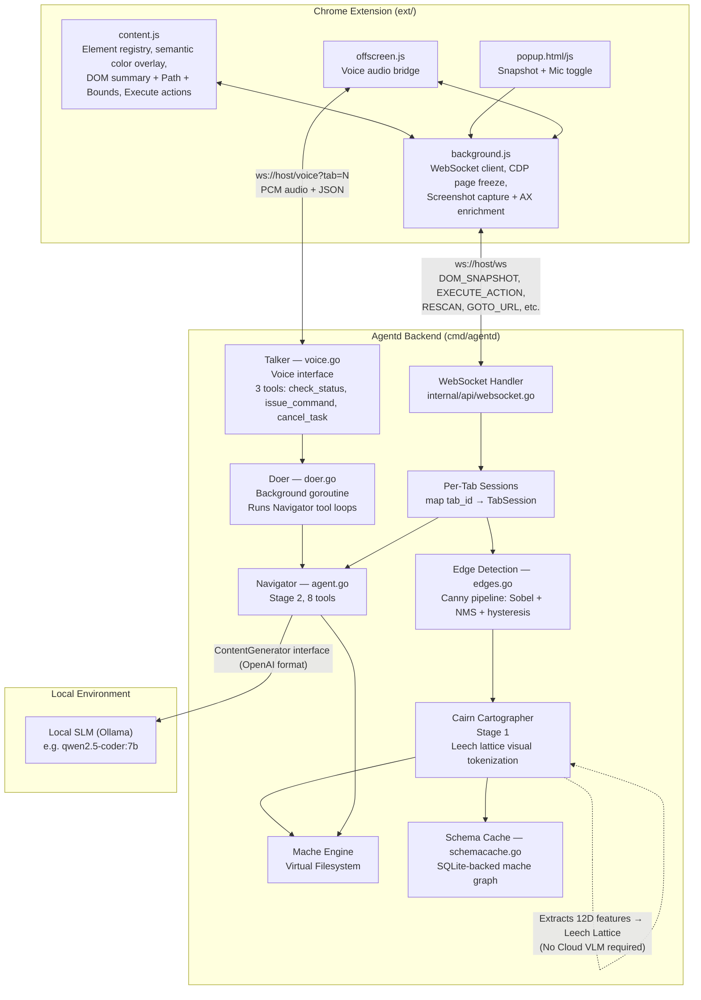
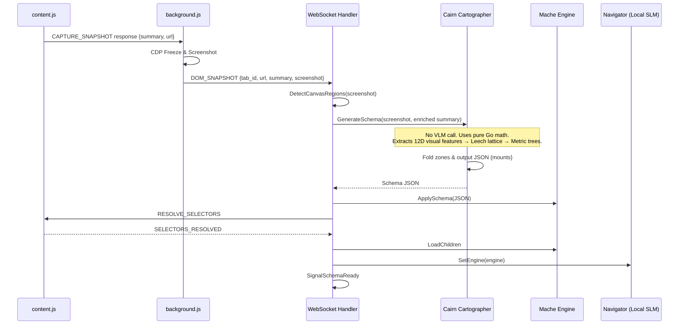

# X-Ray Architecture (SLM & Cairn Edition)

## Table of Contents

- [System Diagram](#system-diagram)
- [Talker / Doer Swarm Architecture](#talker--doer-swarm-architecture)
- [Cairn Cartographer (No VLM)](#cairn-cartographer-no-vlm)
- [Local SLM Navigator](#local-slm-navigator)
- [DOM Snapshot → Cartographer → Schema → VFS Pipeline](#dom-snapshot--cartographer--schema--vfs-pipeline)
- [Virtual Filesystem Layout](#virtual-filesystem-layout)
- [Components](#components)

## System Diagram



## Talker / Doer Swarm Architecture

The voice system splits into two concurrent agents per tab:

- **Talker** (`voice.go`): Always responsive to the user. Has 3 instant tools (no I/O, no blocking). Delegates all page work via `issue_command`.
- **Doer** (`doer.go`): Background goroutine running a multi-step loop. Receives goals from the Talker, dispatches actions, waits for page settle, feeds results back to the Navigator, and repeats.

## Cairn Cartographer (No VLM)

Unlike older architectures that relied on a Vision Language Model (VLM) like Gemini, the **Cairn Cartographer** (`internal/cartographer/cairn*.go`) uses pure algebraic and geometric tokenization:

1. **Feature Extraction:** It samples 12D "optic nerve" feature vectors from screenshot grid cells (RGB, contrast, saturation, Sobel edges, Canny features).
2. **Lattice Quantization:** It projects these features through error-correcting codes into higher dimensions (Gear 1: Tetracode/D4 → Gear 3: M12 → Gear 6: Barnes-Wall BW₃₂ → Leech lattice via Turyn construction).
3. **Metric Trees:** The quantized visual tokens are clustered using neighbor-joining and folded into functional zones (header, main, sidebar, etc.).

This approach is extremely fast, deterministic, fully local, and completely removes the need for a VLM.

## Local SLM Navigator

The Navigator, which is responsible for reasoning and executing tool calls (e.g., `ls`, `cat`, `act`, `goto`), now uses a **Small Language Model (SLM)** locally via Ollama (e.g., `qwen2.5-coder:7b`).

By utilizing the `OllamaGenerator` which talks the OpenAI wire format (`/v1/chat/completions`), the entire multi-step tool execution loop runs locally and air-gapped.

## DOM Snapshot → Cartographer → Schema → VFS Pipeline



## Virtual Filesystem Layout

After the Cairn Cartographer maps a page and the engine loads children, it organizes the page hierarchically:

```
/
├── header/
│   └── global_nav/
│       ├── mache_id
│       └── description
├── main/
│   └── story_list/
│       ├── mache_id
│       ├── description
│       ├── children
│       └── _c/
│           ├── 1/
│           │   ├── mache_id
│           │   ├── tag
│           │   ├── text
│           │   ├── path
│           │   ├── color
│           │   └── bounds
│           └── ...
```

The Navigator (Local SLM) issues tool calls like `ls("/main/story_list")` or `act("/main/story_list/_c/1", "click")` to interact with the virtual filesystem, which translates to actual browser events via the Extension.

## Components

- **Chrome Extension (`ext/`)**: Injected `content.js` maps DOM. `background.js` takes screenshots and sends to Agentd.
- **WebSocket Handler (`internal/api/`)**: Coordinates communication and caches schemas.
- **Cairn Cartographer (`internal/cartographer/cairn.go`)**: Deterministic visual tokenization using the Leech lattice. Replaces VLM.
- **Navigator (`internal/navigator/`)**: Powered by a local SLM (`qwen2.5-coder:7b`) to execute tool calls (`ls`, `cat`, `act`).
- **Mache Engine (`internal/mache/`)**: In-memory VFS mapped from the Cartographer output.
