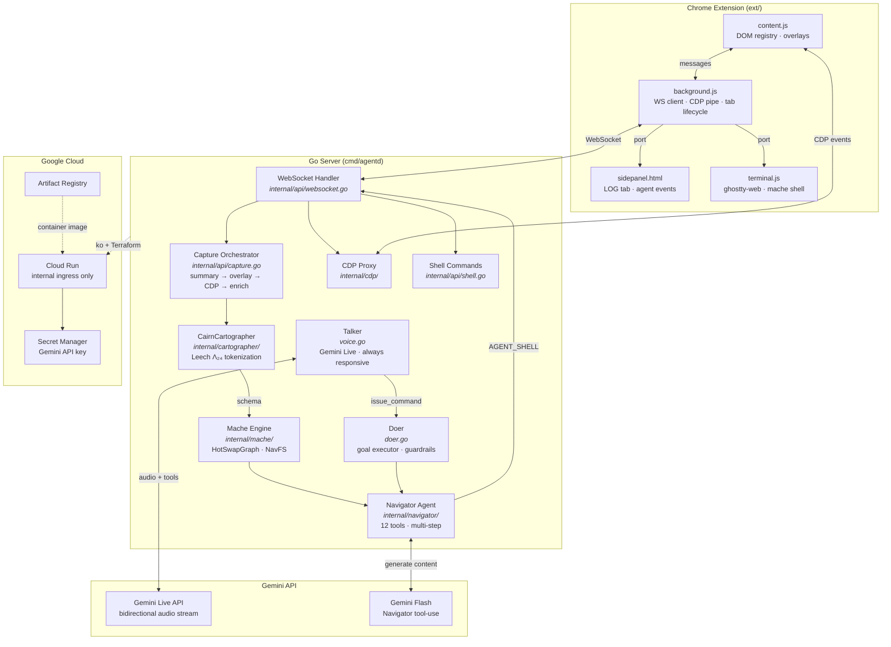
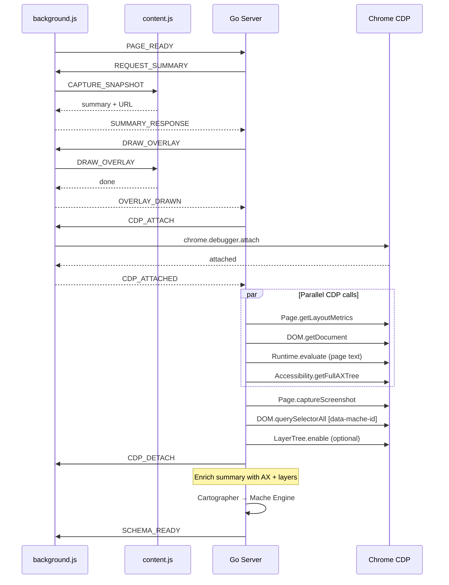
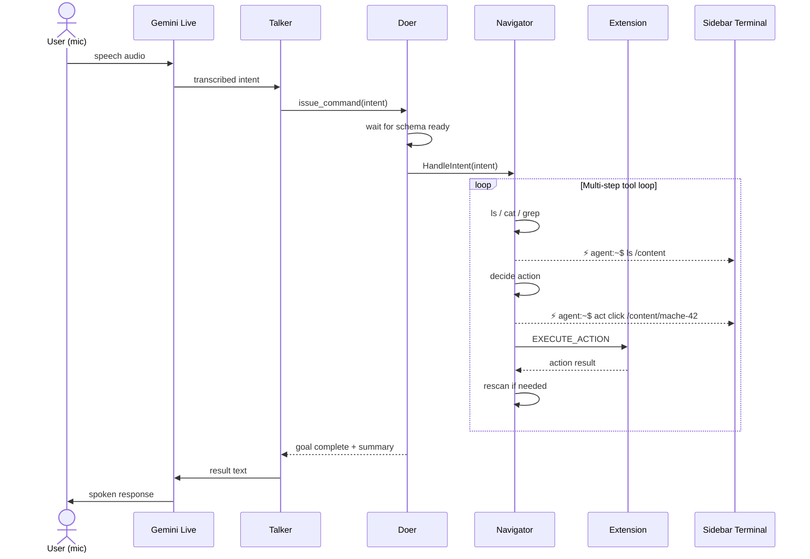

# X-Ray Architecture

## System Overview

X-Ray is a voice-driven UI navigator built on three core ideas:

1. **Pages are filesystems.** Every web page is projected into a virtual filesystem (via [mache](https://github.com/agentic-research/mache)) where zones are directories and elements are files.
2. **Vision without VLMs.** CairnCartographer segments pages using Leech lattice error-correcting codes — pure math, deterministic, ~100ms.
3. **Voice is the interface.** Gemini Live API streams audio bidirectionally with real-time tool execution.

## Data Flow

### Page Capture Pipeline

### Voice Pipeline (Talker/Doer)

## Key Components

### Chrome Extension (`ext/`)

| File | Role |
|------|------|
| `content.js` | DOM element registry, semantic overlays, data-mache-id attributes, action execution |
| `background.js` | Service worker: WS client, CDP dumb pipe, tab lifecycle, message routing |
| `sidepanel.html` | Two tabs: LOG (agent events) and TERMINAL (ghostty-web shell) |
| `terminal.js` | Pseudo-shell over mache VFS + live agent tool call rendering |

### Go Server (`internal/`)

| Package | Role |
|---------|------|
| `api/` | WebSocket handler, capture orchestrator, Talker/Doer, shell commands |
| `cdp/` | CDP proxy (command/response multiplexer), capture helpers (screenshot, AX, layers) |
| `cartographer/` | CairnCartographer (Leech lattice), TropicalCartographer (max-plus), LLM cartographer |
| `navigator/` | Agent with 12 tools, tool registry, NavFS (virtual filesystem over graph) |
| `mache/` | Engine wrapper around mache's HotSwapGraph |
| `config/` | YAML + env config, Ollama params |

### Navigator Tools

| Tool | Description |
|------|-------------|
| `ls(path)` | List zones/elements at a path |
| `cat(path)` | Read element details (tag, bounds, AX role, text) |
| `stat(path)` | Quick metadata without full content |
| `grep(pattern)` | Search across the filesystem |
| `act(action, path, value?)` | Click, type, select, check, focus |
| `scroll(direction)` | Scroll up/down, reports new viewport position |
| `goto(url)` | Navigate to URL |
| `rescan(mache_id?)` | Re-capture page (full or zoomed to element) |
| `list_tabs()` | List open browser tabs |
| `switch_tab(id)` | Switch to a different tab |
| `new_tab(url)` | Open URL in new tab |
| `new_window(url)` | Open URL in new window |

### CairnCartographer

Segments pages without any VLM call:

1. **Fuse** 12 visual features (position, size, color) + 12 semantic DOM features → 24D vector per element
2. **Scale** by √8 and decode to nearest Leech lattice Λ₂₄ point (Construction A: same-parity coords, Golay bits, sum ≡ 0 or 4 mod 8)
3. **Cluster** by lattice point identity → zones
4. Optional sheaf cohomology (H⁰ folding) and curvature weighting for hierarchical structure

Result: deterministic zone segmentation in ~100ms, stable across page loads.

### CDP Proxy (`internal/cdp/`)

The extension acts as a **dumb pipe** for Chrome DevTools Protocol:

- Go sends `CDP_SEND` → extension calls `chrome.debugger.sendCommand` → returns `CDP_RESULT`
- Events flow back via `CDP_EVENT` → per-tab subscriber channels
- Attach/Detach lifecycle managed per-capture
- `Proxy.sender` protected by `sync.RWMutex` for safe WS reconnection
- Event subscriptions are per-tab (`sync.Map`) to avoid cross-tab race conditions

### Sidebar Terminal

The ghostty-web terminal serves two purposes:

1. **User shell**: manually explore the mache VFS (`ls`, `cd`, `cat`, `tree`)
2. **Agent live feed**: Navigator tool calls render in real-time as shell commands with a `⚡ agent:~$` prompt, auto-switching to the terminal tab when the agent starts working

## Deployment

- **Container**: built with [ko](https://ko.build/) (no Dockerfile)
- **Infrastructure**: Terraform → Cloud Run + Artifact Registry + Secret Manager
- **Ingress**: `internal-and-cloud-load-balancing` (not exposed to public internet)
- **Access**: `gcloud run services proxy` for authenticated local tunnel

## Concurrency Model

- Per-tab `captureSem` (channel semaphore) serializes captures, respects context cancellation
- Connection-scoped context cancels all goroutines on WS disconnect
- `HotSwapGraph` provides lock-free reads with atomic pointer swap on schema updates
- Doer runs as a background goroutine per goal; Talker remains responsive during execution
