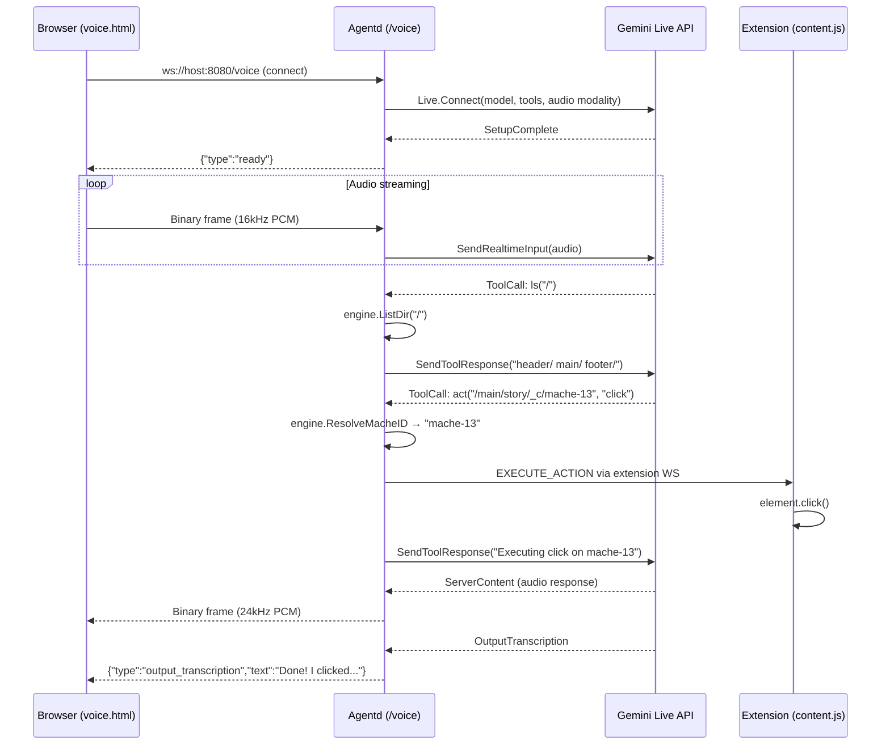

# X-Ray Architecture

## System Diagram

```
┌─────────────────────────────────────────────────┐
│  Chrome Extension (ext/)                         │
│  ┌───────────────┐  ┌────────────────────────┐  │
│  │ content.js     │  │ background.js          │  │
│  │ • Tag IDs      │  │ • WebSocket client     │  │
│  │ • DOM summary  │  │ • Screenshot capture   │  │
│  │ • Execute acts │  │ • Action dispatch      │  │
│  └───────────────┘  └──────────┬─────────────┘  │
└─────────────────────────────────┼────────────────┘
                                  │ WebSocket
                                  │ ws://host:8080/ws
                                  ▼
┌──────────────────────────────────────────────────┐
│  Agentd Backend (cmd/agentd)                      │
│                                                    │
│  ┌──────────────────────┐                          │
│  │ WebSocket Handler     │  (internal/api/)        │
│  │ • DOM_SNAPSHOT intake │                          │
│  │ • NAVIGATE dispatch   │                          │
│  │ • EXECUTE_ACTION send │                          │
│  └──────────┬───────────┘                          │
│             │                                       │
│  ┌──────────▼───────────┐  ┌─────────────────────┐│
│  │ Cartographer          │  │ Navigator            ││
│  │ (Stage 1)             │  │ (Stage 2)            ││
│  │                       │  │                      ││
│  │ • Screenshot + DOM    │  │ • ls / cat / act     ││
│  │ • Gemini Vision       │  │ • Gemini Tool-Use    ││
│  │ • Structured JSON out │  │ • Intent → Action    ││
│  └──────────┬───────────┘  └──────────┬───────────┘│
│             │                          │             │
│  ┌──────────▼──────────────────────────▼───────────┐│
│  │ Mache Engine (internal/mache/)                   ││
│  │ • ApplySchema() → virtual filesystem tree        ││
│  │ • LoadChildren() → zone child resolution         ││
│  │ • ResolveMacheID() → DOM element ID              ││
│  └──────────────────────────────────────────────────┘│
└───────────────────────────────────────────────────────┘
                            │
                            ▼ Gemini API
               ┌──────────────────────────┐
               │ Google Cloud              │
               │ • Gemini 2.5 Flash        │
               │ • Cloud Run (hosting)     │
               └──────────────────────────┘
```

## Data Flow (Per Interaction)

A single user interaction flows through these stages:

### 1. Capture (Extension → Backend)
1. User clicks the X-Ray extension icon on any webpage.
2. `content.js` injects `data-mache-id` attributes into every interactive element (`<a>`, `<button>`, `<input>`, etc.) and structural containers holding 2+ interactive children.
3. `content.js` generates a flattened text summary: `ID: mache-X | Parent: mache-Y | Tag: a | Text: "..."` (capped at 300 elements).
4. `background.js` captures a viewport screenshot via `chrome.tabs.captureVisibleTab()`.
5. The screenshot (base64 PNG) + summary are sent as a `DOM_SNAPSHOT` message over WebSocket.

### 2. Schema Generation (Cartographer)
6. The **Cartographer** receives the screenshot + summary and calls Gemini Vision.
7. Gemini analyzes the visual layout and maps it to 3-7 semantic zones, selecting one `data-mache-id` per zone as the root.
8. Output is structured JSON via Gemini's `ResponseSchema` constraint — the model cannot hallucinate IDs or invent fields.
9. The schema is saved to `logs/schema/` for debugging.

### 3. Filesystem Construction (Mache Engine)
10. `Engine.ApplySchema()` parses the JSON and builds a virtual directory tree.
11. `Engine.LoadChildren()` parses the DOM summary, performs BFS from each zone's root ID (max depth 2), and populates `children` files and `_c/` subdirectories with individual elements.
12. Each zone directory contains: `mache_id`, `description`, `children`, and `_c/<mache-id>/` subdirs.

### 4. Navigation (Navigator)
13. User sends an intent (e.g., "click the first story") via WebSocket (`NAVIGATE`) or HTTP POST (`/navigate`).
14. The **Navigator** receives the intent and enters a tool-use loop (max 5 iterations):
    - `ls("/")` → sees top-level zones
    - `ls("/main/story_list")` → sees `_c/`, `children`, `description`, `mache_id`
    - `cat("/main/story_list/children")` → reads child elements with their IDs and text
    - `act("/main/story_list/_c/mache-13", "click")` → resolves to a real `data-mache-id`
15. The resolved action is sent back as `EXECUTE_ACTION` via WebSocket.

### 5. Execution (Backend → Extension)
16. `background.js` receives `EXECUTE_ACTION` and forwards it to `content.js`.
17. `content.js` finds the DOM element by `data-mache-id` and calls `element.click()` or `element.focus()`.

## Components

### Chrome Extension (`ext/`)

Three files, no build step, no dependencies.

- **`content.js`**: Injected into every page. Tags interactive elements with `data-mache-id` (monotonic counter), generates the flat text summary, and executes browser actions (`click`, `focus`) on command.
- **`background.js`**: Service worker. Manages the WebSocket connection to agentd with auto-reconnect. Captures screenshots via `chrome.tabs.captureVisibleTab()`. Routes `EXECUTE_ACTION` messages from the backend to the active tab's content script.
- **`manifest.json`**: Manifest V3. Permissions: `activeTab`, `scripting`, `tabs`. Host permission for the WebSocket endpoint.

### WebSocket Handler (`internal/api/`)

Bidirectional communication layer between the extension and the AI agents.

- **Inbound messages**: `DOM_SNAPSHOT` (screenshot + summary), `NAVIGATE` (user intent).
- **Outbound messages**: `SCHEMA_READY` (schema JSON), `EXECUTE_ACTION` (mache_id + action), `STATUS` (progress updates).
- Also exposes `POST /navigate` for curl/testing without the extension.

### Cartographer (`internal/cartographer/`)

Stage 1 agent. Takes a screenshot + DOM summary and produces a semantic JSON schema.

- Uses Gemini Vision with structured output (`ResponseSchema` + `ResponseMIMEType: "application/json"`).
- System prompt constrains output to 3-7 top-level zones — no individual element enumeration.
- Temperature 0.1 for near-deterministic results.
- Output format: `{"mounts": [{"virtual_path": "/header/nav", "mache_id": "mache-42", "description": "..."}]}`.

### Navigator (`internal/navigator/`)

Stage 2 agent. Takes a user intent and resolves it to a browser action via filesystem traversal.

- Three tools: `ls` (list directory), `cat` (read file), `act` (execute action).
- Tool-use loop: max 5 iterations. Typical resolution: 3-4 tool calls.
- System prompt enforces: never guess paths, always `ls` before `cat`/`act`, never hallucinate tools.
- Temperature 0.1.
- Returns `ActionResult{MacheID, Action, Path}` or a text explanation if the intent can't be resolved.

### Mache Engine (`internal/mache/`)

In-memory virtual filesystem that maps Cartographer output to navigable paths.

- `ApplySchema()`: Parses Cartographer JSON, builds directory tree with `mache_id` and `description` files at each zone.
- `LoadChildren()`: Parses the DOM summary, performs BFS from each zone root (max depth 2, max 30 children), creates `children` summary file and `_c/<id>/` subdirectories.
- `ListDir()` / `ReadFile()` / `ResolveMacheID()`: Standard filesystem operations used by the Navigator's tools.
- Built on the [mache](https://github.com/agentic-research/mache) schema types (`api.Topology`, `api.Node`).

### Gate Test (`cmd/gate/`)

Offline accuracy validation. Runs the Cartographer + Mache Engine against captured page snapshots (HTML + screenshot) and verifies the generated schema makes sense. Used for regression testing without live browser interaction.

## Technical Details (Judging-Relevant)

### Zero-Hallucination Gate
The Cartographer uses Gemini's structured output mode (`ResponseSchema` + `ResponseMIMEType`). The model must output valid JSON matching the declared schema — it cannot invent fields or produce free-form text. The `mache_id` values are cross-referenced against the DOM summary to ensure they exist.

### Temperature Control
Both agents run at temperature 0.1. This ensures near-deterministic behavior: the same page + intent produces the same action across runs. This is critical for reliability in a voice-driven UI navigation context.

### Latency Budget
- Extension capture: ~100ms (DOM tagging + screenshot)
- Cartographer (Gemini Vision): ~3-5s
- Mache engine build: <1ms (in-memory tree construction)
- Navigator tool-use loop: ~2-4s (3-4 Gemini calls)
- Total: **under 10 seconds** from click to action

### ID Injection Strategy
The extension tags `<a>`, `<button>`, `<input>`, `<select>`, `<textarea>`, and `[role="button"]` elements. Structural containers (`<main>`, `<section>`, `<nav>`, etc.) are tagged only if they contain 2+ interactive children. This balances completeness with signal-to-noise ratio — the Cartographer sees meaningful containers, not every wrapper div.

## Voice Mode (Gemini Live API)

X-Ray supports voice interaction via the Gemini Live API. The user speaks into a browser mic, audio streams through agentd to Gemini Live, tool calls execute locally, and Gemini's spoken response streams back for playback.

### Voice Data Flow



### Voice Architecture

```
Browser (mic + speaker)
  │
  ├── ws://host:8080/ws ──── Extension WebSocket (DOM snapshots, execute actions)
  │
  └── ws://host:8080/voice ── Voice audio streaming
      │
      ▼
  Agentd Backend
      │
      ├── Proxies PCM audio chunks to Gemini Live API (Go SDK)
      ├── Receives tool calls (ls, cat, act) from Gemini Live
      ├── Executes tools locally against Mache Engine
      ├── Sends tool responses back to Gemini Live
      ├── Streams Gemini's audio response back to browser
      └── When act() fires → sends EXECUTE_ACTION over extension WS
```

### Audio Formats

| Leg | Format | Sample Rate |
|-----|--------|-------------|
| Browser → Agentd | 16-bit PCM, mono | 16 kHz |
| Agentd → Gemini Live | Same (proxied) | 16 kHz |
| Gemini Live → Agentd | 16-bit PCM, mono | 24 kHz |
| Agentd → Browser | Same (proxied) | 24 kHz |

### Voice UI

Served at `http://host:8080/voice-ui` — a standalone HTML page with mic button, AudioContext playback, and live transcription display. No extension permissions needed.

### Google Cloud Services Used
- **Gemini 2.5 Flash** via the GenAI Go SDK (`google.golang.org/genai`)
- **Gemini Live API** (native audio) for real-time voice interaction
- **Cloud Run** for hosting the agentd backend
