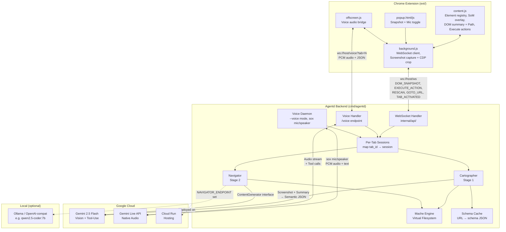
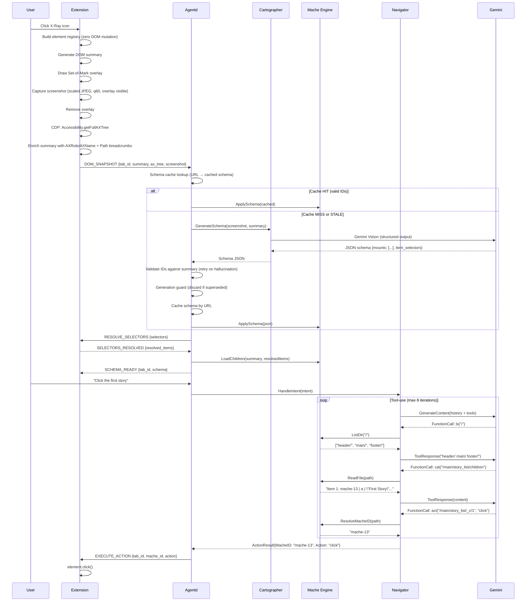
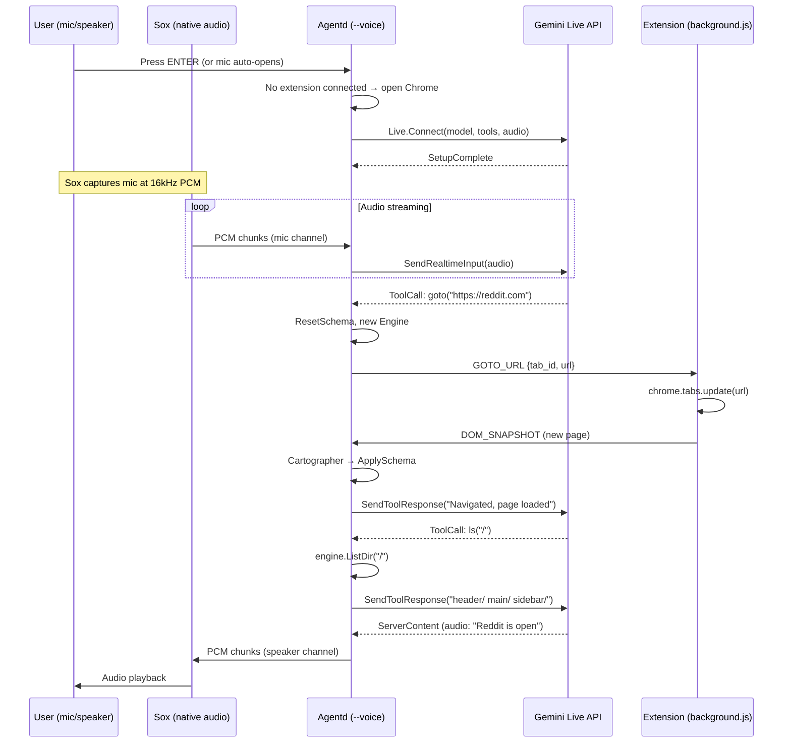
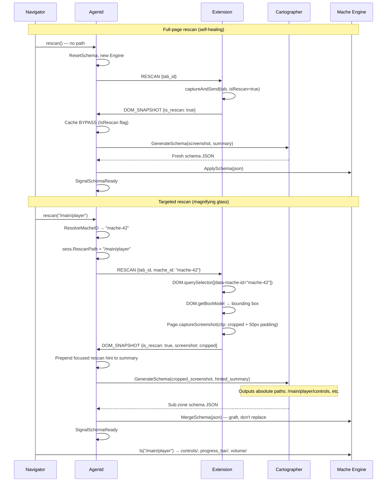
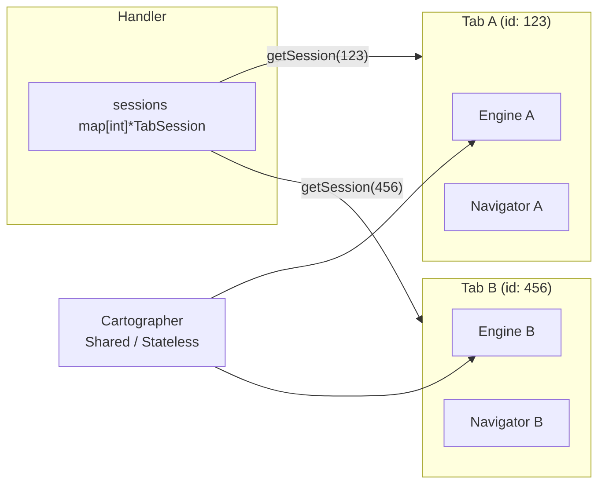
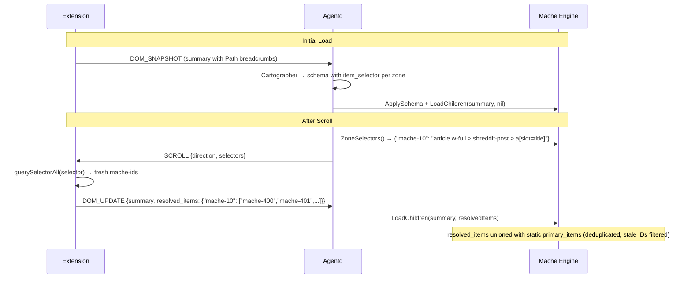

# X-Ray Architecture

## System Diagram



## Data Flow (Per Interaction)



## Voice Data Flow


## Voice Daemon Data Flow



## Rescan Flow (Self-Healing + Magnifying Glass)



## Per-Tab Session Architecture



## Virtual Filesystem Layout

After the Cartographer maps a page and the engine loads children:

```
/
├── header/
│   └── global_nav/
│       ├── mache_id          → "mache-0"
│       └── description       → "Top navigation bar"
├── main/
│   └── story_list/
│       ├── mache_id          → "mache-15"
│       ├── description       → "List of news stories"
│       ├── children           → "[1] \"First Story Title\"\n[2] \"Second Story\"..."
│       └── _c/
│           ├── 1/                          # Ordinal — model never sees raw IDs
│           │   ├── mache_id  → "mache-13"
│           │   ├── tag       → "a"
│           │   └── text      → "First Story Title"
│           ├── 2/
│           └── ...
└── footer/
    └── links/
        ├── mache_id          → "mache-200"
        └── description       → "Footer with legal links"
```

## Dynamic CSS Selectors (Scroll Architecture)

On initial page load, the Cartographer identifies primary items by mache-id. But after scrolling, new content gets new IDs not in the original list. The dynamic selector architecture solves this:



**Key insight**: The LLM identifies *what* matters visually (story titles vs. metadata links) and synthesizes a CSS selector. The browser executes it deterministically at scroll time. Both sources are unioned — neither the LLM's visual pass nor the CSS selector alone is reliable, but together they handle brittle selectors, lazy visual passes, SPA edge cases, and infinite scroll. This hybrid keeps the LLM for pattern recognition and delegates execution to `querySelectorAll`.

**Summary line format** (breadcrumb injection):
```
ID: mache-16 | Parent: mache-10 | Tag: a | Text: "Story Title" | Path: article.w-full > h3.title > a
```

The `Path` field gives the Cartographer 2-3 levels of DOM ancestry with CSS classes, enabling it to output selectors like `article.w-full > shreddit-post > a[slot=title]`. Selectors must match exactly one element per repeating item (the title link, not metadata) — child combinators (`>`) are preferred over broad descendant selectors.

## Audio Formats

| Leg | Format | Sample Rate |
|-----|--------|-------------|
| Browser → Agentd | 16-bit PCM, mono | 16 kHz |
| Sox mic → Agentd (daemon) | 16-bit PCM, mono | 16 kHz |
| Agentd → Gemini Live | Same (proxied) | 16 kHz |
| Gemini Live → Agentd | 16-bit PCM, mono | 24 kHz |
| Agentd → Browser | Same (proxied) | 24 kHz |
| Agentd → Sox speaker (daemon) | 16-bit PCM, mono | 24 kHz |

## Components

### Chrome Extension (`ext/`)

Seven files, no build step, no dependencies.

- **`content.js`**: Injected into every page. Builds an in-memory element registry (zero DOM mutation — SPA-safe), draws/removes Set-of-Mark overlay for screenshot capture, generates flat text summary with DOM breadcrumb paths (`| Path: div.post > h3.title > a`), executes browser actions on command, evaluates CSS selectors after scroll to resolve fresh primary items.
- **`background.js`**: Service worker. WebSocket to agentd, screenshot capture (full-page and targeted crop via CDP `DOM.getBoxModel`), CDP accessibility tree capture + AX-to-mache-id mapping, offscreen doc lifecycle, per-tab schema tracking. Handles `RESCAN` (with optional mache_id for magnifying glass crop), `GOTO_URL`, `SCROLL`, `EXECUTE_ACTION`. Sends `TAB_ACTIVATED` on connect and tab switch. Falls back to querying active tab when `tab_id` is 0.
- **`popup.html/js`**: Extension popup. Snapshot button, mic toggle, session kill button.
- **`offscreen.html/js`**: Persistent voice audio bridge. Mic capture (48→16kHz downsample), PCM streaming, audio playback (24kHz).
- **`manifest.json`**: Manifest V3. Permissions: `activeTab`, `debugger`, `scripting`, `tabs`, `offscreen`.

#### Accessibility Tree Enrichment (CDP)

During snapshot capture, `background.js` attaches the Chrome DevTools Protocol debugger to the active tab and:

1. Calls `Accessibility.getFullAXTree` for the browser's computed AX tree
2. Calls `DOM.querySelectorAll('[data-mache-id]')` + `DOM.describeNode` (batched via `Promise.all`) to map registry IDs to backend DOM node IDs
3. Joins AX nodes with mache-ids via `backendDOMNodeId`
4. Enriches each summary line with `AXRole` and `AXName` (e.g., `| AXRole: navigation | AXName: "Primary nav"`)
5. Sends a compact `ax_tree` field alongside the enriched summary in `DOM_SNAPSHOT`

This gives the Cartographer the browser's semantic truth — implicit roles (`<button>` → `button`), computed accessible names, CSS-visibility-aware filtering — rather than raw `aria-*` attribute scraping.

### WebSocket Handler (`internal/api/`)

- Per-tab session registry (`sessions map[int]*TabSession`)
- `SchemaGenerator`, `IntentHandler`, and `ContentGenerator` interfaces decouple Cartographer/Navigator/LLM for testability
- **Schema cache**: URL → schema JSON, backed by SQLite (`~/.xray/schemas.db`). Cache hit validates IDs against current DOM summary; stale entries trigger re-generation. Rescan bypasses cache via `IsRescan` flag.
- **Generation counter**: Each `handleDOMSnapshot` increments `schemaGen` on the session. If a newer snapshot starts processing (e.g., double goto), the stale Cartographer result is discarded before caching or applying.
- Inbound: `DOM_SNAPSHOT` (screenshot + summary + ax_tree + tab_id + is_rescan), `DOM_UPDATE` (summary + resolved_items), `NAVIGATE` (intent + tab_id), `TAB_ACTIVATED` (tab_id), `SELECTORS_RESOLVED` (resolved_items)
- Outbound: `SCHEMA_READY`, `EXECUTE_ACTION`, `SCROLL` (direction + selectors), `RESOLVE_SELECTORS`, `RESCAN` (tab_id + optional mache_id), `GOTO_URL` (tab_id + url), `STATUS` — all include `tab_id`
- Voice handler: `/voice?tab=N` — Gemini Live proxy with server-side audio suppression during tool loops (prevents the agent from narrating its internal tool-use thought process, resulting in a clean, snappy voice UX)
- Voice daemon: `StartVoiceLoop` — native mic/speaker via sox, same tool set + Google Search Grounding. Opens Chrome on cold start if no extension connected.
- `POST /navigate` for curl/testing

### Cartographer (`internal/cartographer/`)

Stage 1. Screenshot + DOM summary → semantic JSON schema.

- Gemini Vision with structured output (`ResponseSchema`)
- 3-7 zones, primary items for list zones, CSS `item_selector` for dynamic resolution
- Each summary line includes DOM breadcrumb paths; Cartographer uses these to synthesize structural CSS selectors per zone
- Temperature 0.1, validation + retry on hallucination

### Navigator (`internal/navigator/`)

Stage 2. User intent → browser action via filesystem traversal.

- **`ContentGenerator` interface** (`model.go`): Abstracts the LLM call so Navigator can use Gemini, Ollama, or a mock
  - `GeminiGenerator`: Wraps `genai.Client.Models.GenerateContent()` (default)
  - `OllamaGenerator`: Talks OpenAI wire format (`/v1/chat/completions`); translates genai types ↔ OpenAI messages/tools/tool_calls
  - `GemmaGenerator`: Embeds tool definitions in system prompt, parses function calls from model text output as JSON. Accepts both `"parameters"` (Gemma) and `"arguments"` (Qwen) wire formats via regex. Used when `NAVIGATOR_FORMAT=gemma`
- Six tools: `ls`, `cat`, `act`, `scroll`, `goto`, `rescan`
  - `goto(url)`: Navigate browser to a new URL. Resets engine, waits for new schema.
  - `rescan(path?)`: Full-page rescan (no path or `"/"`) or targeted magnifying glass (with zone path). Targeted rescan resolves mache_id, crops screenshot, merges sub-zones via `MergeSchema`.
- Max 8 tool-use iterations (typical: 3-4; scroll workflows use more)
- Temperature 0.1
- Returns `ActionResult{MacheID, Action, Path}` or text explanation

**Env vars for local model override:**
```
NAVIGATOR_ENDPOINT=http://localhost:11434/v1   # empty = use Gemini cloud
NAVIGATOR_MODEL=qwen2.5-coder:7b              # empty = use GEMINI_MODEL
NAVIGATOR_FORMAT=gemma                         # "gemma" = text-based JSON parsing; empty = OpenAI tool_calls
```

### Mache Engine (`internal/mache/`)

In-memory virtual filesystem from Cartographer output.

- `ApplySchema()` → destructive: clears store, builds fresh directory tree with `Mount.ItemSelector` for dynamic CSS selectors
- `MergeSchema()` → non-destructive: grafts new mounts into existing filesystem. Used by targeted rescan (magnifying glass) to add sub-zones without losing existing state. Cartographer outputs absolute paths (e.g., `/main/player/controls`), so no prefix concatenation needed.
- `LoadChildren(summary, resolvedItems)` → parent-chain zone membership, max 200 children per zone, ordinal `_c/` entries (`1/`, `2/`, ...). Unions static `PrimaryItems` with browser-resolved CSS selector results (deduplicated, stale IDs filtered against current DOM summary)
- `ZoneSelectors()` → returns `map[macheID]cssSelector` for scroll-time evaluation
- `ListDir()` / `ReadFile()` / `ResolveMacheID()` — Navigator's tool implementations
- `ValidateSchema()` — checks all mache_ids in schema exist in DOM summary. Used for cache validation and hallucination detection.
- `parseSummary()` handles optional `Path`, `AXRole`, `AXName` trailing fields (backward-compatible with old format)

## Google Cloud Services

- **Gemini 2.5 Flash** via GenAI Go SDK (`google.golang.org/genai`) — Cartographer + Navigator (default; Navigator swappable via `ContentGenerator` interface)
- **Gemini Live API** (native audio, `v1alpha`) — real-time voice interaction (browser `/voice` endpoint + native `--voice` daemon)
- **Google Search Grounding** — Gemini executes searches server-side via `GoogleSearch` tool (voice mode only)
- **Cloud Run** — serverless hosting for agentd backend
- **Cloud Build** — container image builds from source
