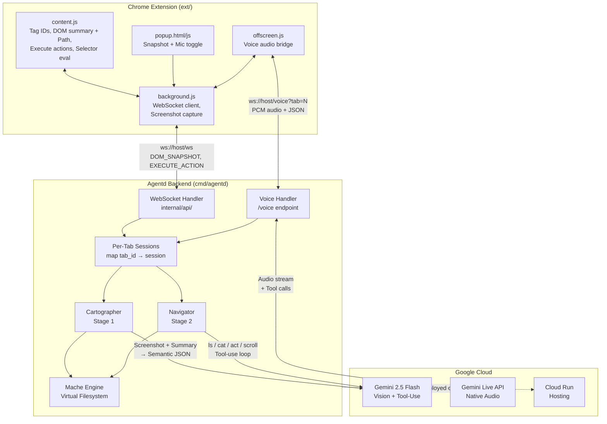
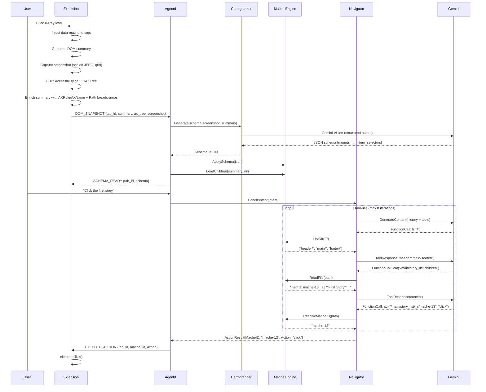
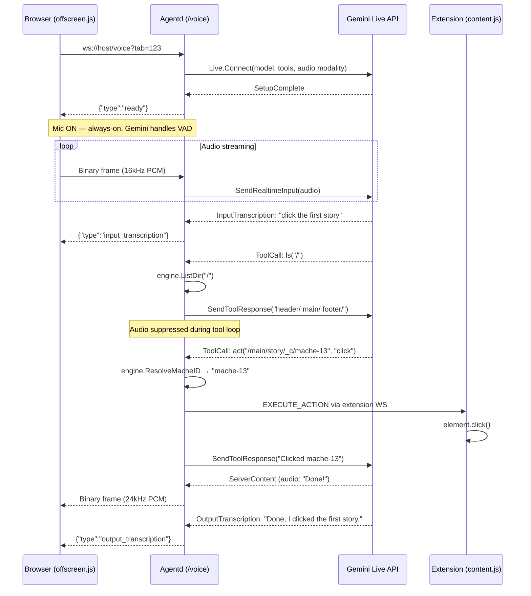
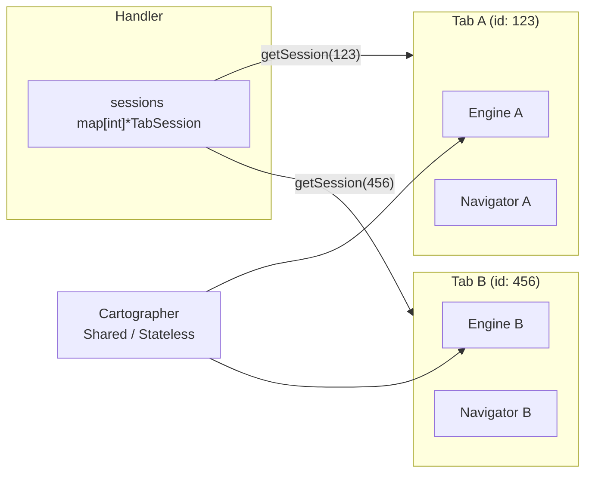
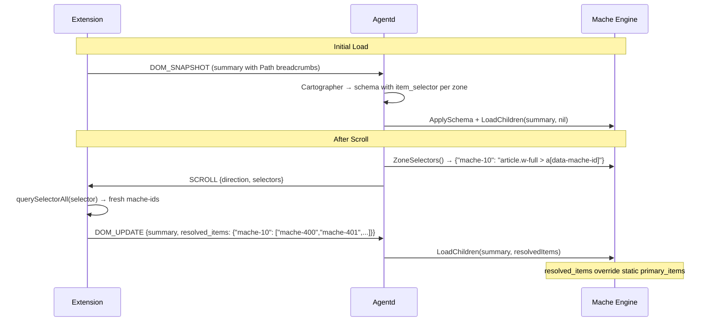

# X-Ray Architecture

## System Diagram



## Data Flow (Per Interaction)



## Voice Data Flow



## Per-Tab Session Architecture



## Virtual Filesystem Layout

After the Cartographer maps a page and the engine loads children:

```
/
├── header/
│   └── global_nav/
│       ├── mache_id          → "mache-0"
│       └── description       → "Top navigation bar"
├── main/
│   └── story_list/
│       ├── mache_id          → "mache-15"
│       ├── description       → "List of news stories"
│       ├── children           → "Item 1: mache-13 | a | \"First Story\"..."
│       └── _c/
│           ├── mache-13/
│           │   ├── mache_id  → "mache-13"
│           │   ├── tag       → "a"
│           │   └── text      → "First Story Title"
│           ├── mache-14/
│           └── ...
└── footer/
    └── links/
        ├── mache_id          → "mache-200"
        └── description       → "Footer with legal links"
```

## Dynamic CSS Selectors (Scroll Architecture)

On initial page load, the Cartographer identifies primary items by mache-id. But after scrolling, new content gets new IDs not in the original list. The dynamic selector architecture solves this:



**Key insight**: The LLM identifies *what* matters visually (story titles vs. metadata links) and synthesizes a CSS selector. The browser executes it deterministically at scroll time. This hybrid keeps the LLM for pattern recognition and delegates execution to `querySelectorAll`.

**Summary line format** (breadcrumb injection):
```
ID: mache-16 | Parent: mache-10 | Tag: a | Text: "Story Title" | Path: article.w-full > h3.title > a
```

The `Path` field gives the Cartographer 2-3 levels of DOM ancestry with CSS classes, enabling it to output selectors like `article.w-full > shreddit-post.block > a.absolute[data-mache-id]`.

## Audio Formats

| Leg | Format | Sample Rate |
|-----|--------|-------------|
| Browser → Agentd | 16-bit PCM, mono | 16 kHz |
| Agentd → Gemini Live | Same (proxied) | 16 kHz |
| Gemini Live → Agentd | 16-bit PCM, mono | 24 kHz |
| Agentd → Browser | Same (proxied) | 24 kHz |

## Components

### Chrome Extension (`ext/`)

Seven files, no build step, no dependencies.

- **`content.js`**: Injected into every page. Tags interactive elements with `data-mache-id`, generates flat text summary with DOM breadcrumb paths (`| Path: div.post > h3.title > a`), executes browser actions on command, evaluates CSS selectors after scroll to resolve fresh primary items.
- **`background.js`**: Service worker. WebSocket to agentd, screenshot capture, CDP accessibility tree capture + AX-to-mache-id mapping, offscreen doc lifecycle, per-tab schema tracking.
- **`popup.html/js`**: Extension popup. Snapshot button, mic toggle, session kill button.
- **`offscreen.html/js`**: Persistent voice audio bridge. Mic capture (48→16kHz downsample), PCM streaming, audio playback (24kHz).
- **`manifest.json`**: Manifest V3. Permissions: `activeTab`, `debugger`, `scripting`, `tabs`, `offscreen`.

#### Accessibility Tree Enrichment (CDP)

During snapshot capture, `background.js` attaches the Chrome DevTools Protocol debugger to the active tab and:

1. Calls `Accessibility.getFullAXTree` for the browser's computed AX tree
2. Calls `DOM.querySelectorAll('[data-mache-id]')` + `DOM.describeNode` (batched via `Promise.all`) to map mache-ids to backend DOM node IDs
3. Joins AX nodes with mache-ids via `backendDOMNodeId`
4. Enriches each summary line with `AXRole` and `AXName` (e.g., `| AXRole: navigation | AXName: "Primary nav"`)
5. Sends a compact `ax_tree` field alongside the enriched summary in `DOM_SNAPSHOT`

This gives the Cartographer the browser's semantic truth — implicit roles (`<button>` → `button`), computed accessible names, CSS-visibility-aware filtering — rather than raw `aria-*` attribute scraping.

### WebSocket Handler (`internal/api/`)

- Per-tab session registry (`sessions map[int]*TabSession`)
- `SchemaGenerator` and `IntentHandler` interfaces decouple Cartographer/Navigator for testability
- Inbound: `DOM_SNAPSHOT` (screenshot + summary + ax_tree + tab_id), `DOM_UPDATE` (summary + resolved_items), `NAVIGATE` (intent + tab_id)
- Outbound: `SCHEMA_READY`, `EXECUTE_ACTION`, `SCROLL` (direction + selectors), `STATUS` — all include `tab_id`
- Voice handler: `/voice?tab=N` — Gemini Live proxy with server-side audio suppression during tool loops
- `POST /navigate` for curl/testing

### Cartographer (`internal/cartographer/`)

Stage 1. Screenshot + DOM summary → semantic JSON schema.

- Gemini Vision with structured output (`ResponseSchema`)
- 3-7 zones, primary items for list zones, CSS `item_selector` for dynamic resolution
- Each summary line includes DOM breadcrumb paths; Cartographer uses these to synthesize structural CSS selectors per zone
- Temperature 0.1, validation + retry on hallucination

### Navigator (`internal/navigator/`)

Stage 2. User intent → browser action via filesystem traversal.

- Four tools: `ls`, `cat`, `act`, `scroll`
- Max 8 tool-use iterations (typical: 3-4; scroll workflows use more)
- Temperature 0.1
- Returns `ActionResult{MacheID, Action, Path}` or text explanation

### Mache Engine (`internal/mache/`)

In-memory virtual filesystem from Cartographer output.

- `ApplySchema()` → directory tree with `Mount.ItemSelector` for dynamic CSS selectors
- `LoadChildren(summary, resolvedItems)` → parent-chain zone membership, max 200 children per zone. When `resolvedItems` (from browser CSS selector evaluation) is present, overrides static `PrimaryItems`
- `ZoneSelectors()` → returns `map[macheID]cssSelector` for scroll-time evaluation
- `ListDir()` / `ReadFile()` / `ResolveMacheID()` — Navigator's tool implementations
- `parseSummary()` handles optional `Path`, `AXRole`, `AXName` trailing fields (backward-compatible with old format)

## Google Cloud Services

- **Gemini 2.5 Flash** via GenAI Go SDK (`google.golang.org/genai`) — Cartographer + Navigator
- **Gemini Live API** (native audio, `v1alpha`) — real-time voice interaction
- **Cloud Run** — serverless hosting for agentd backend
- **Cloud Build** — container image builds from source
