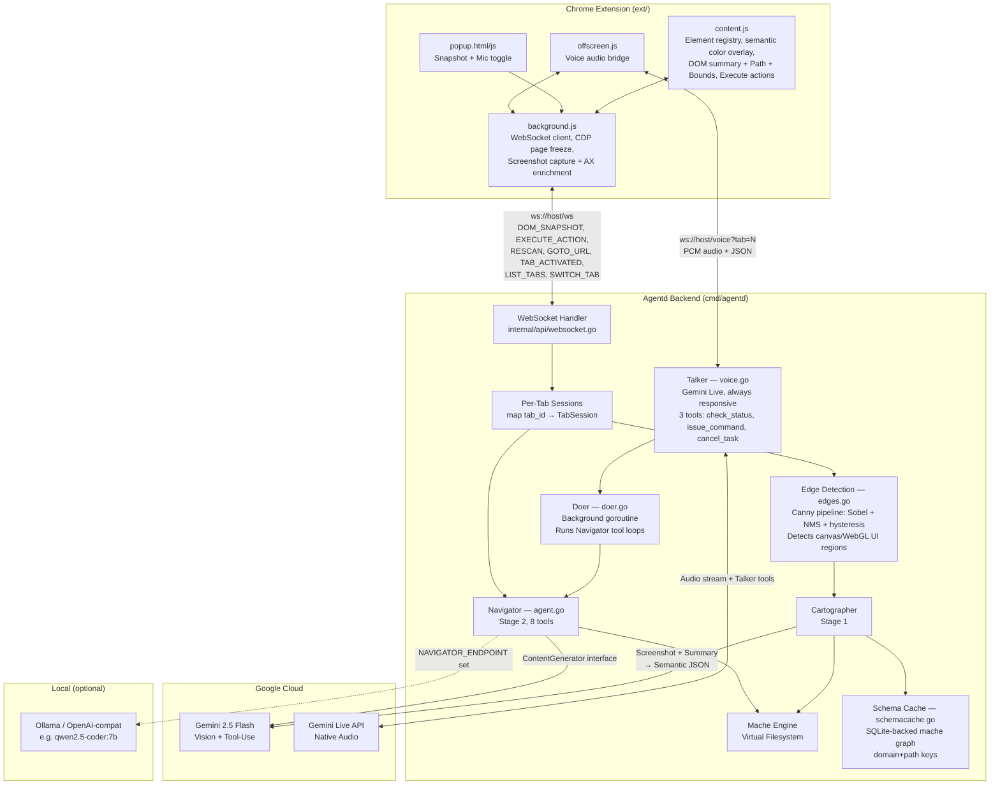
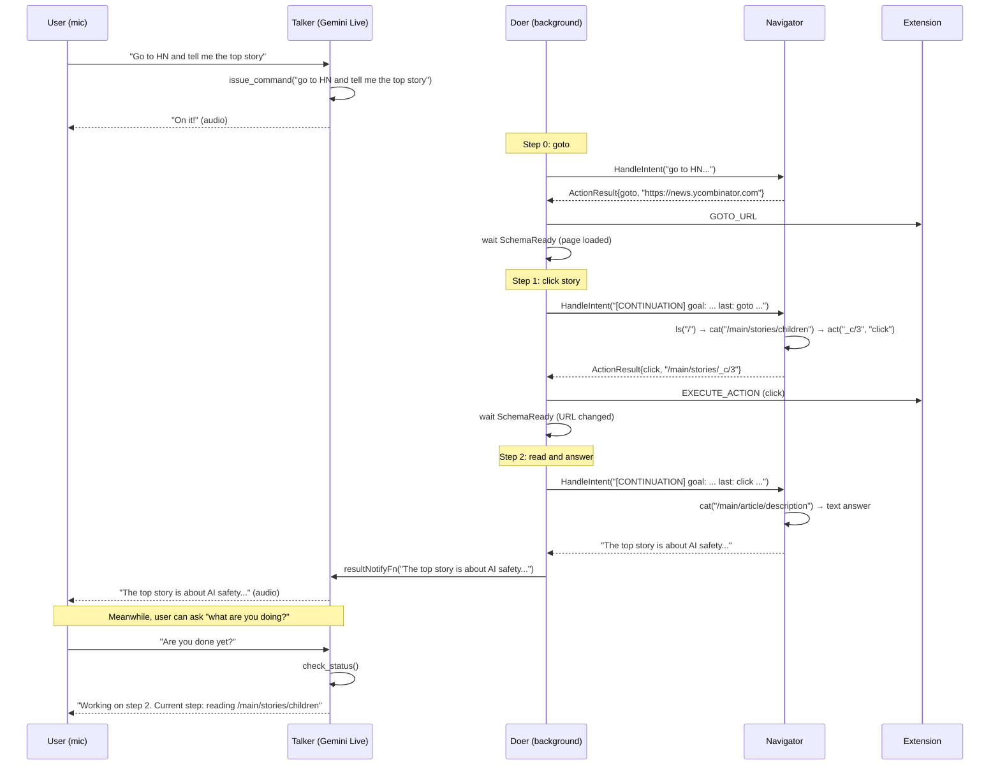
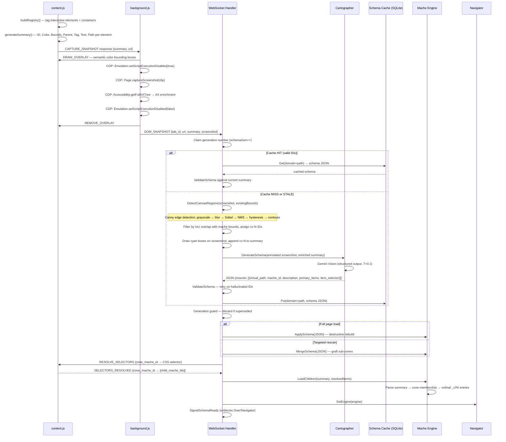
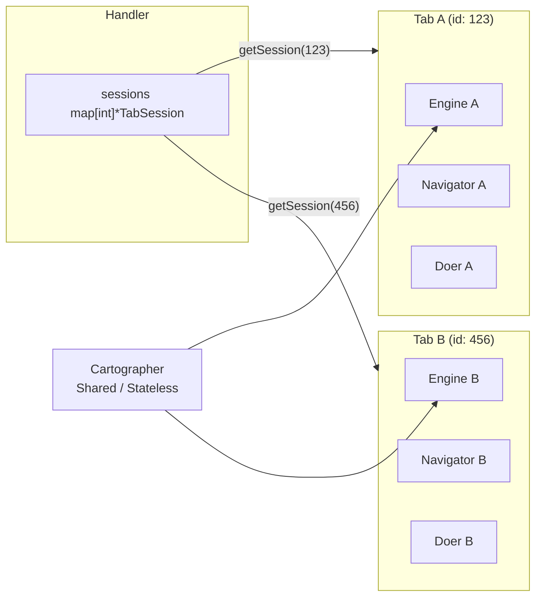
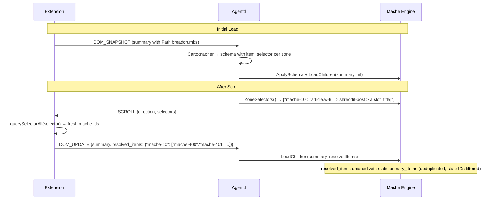
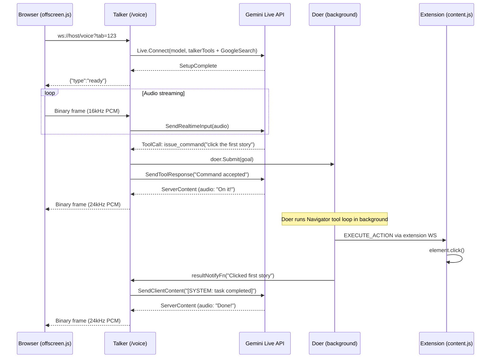
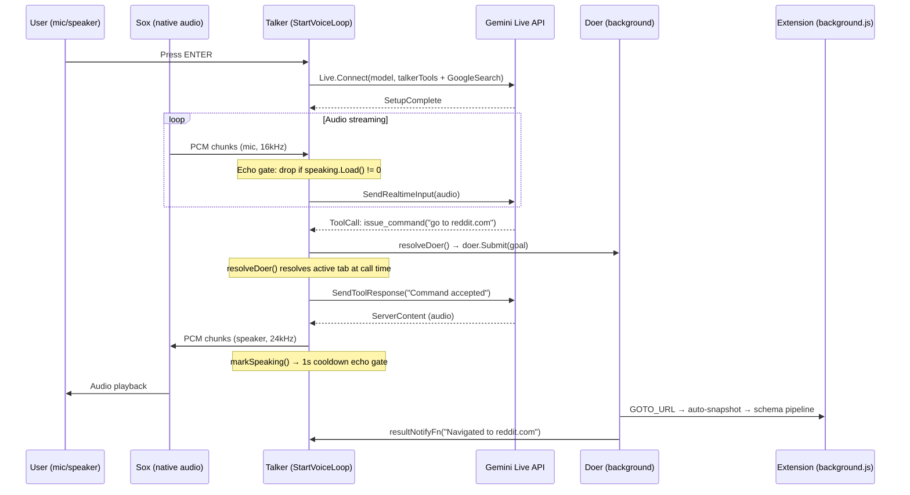
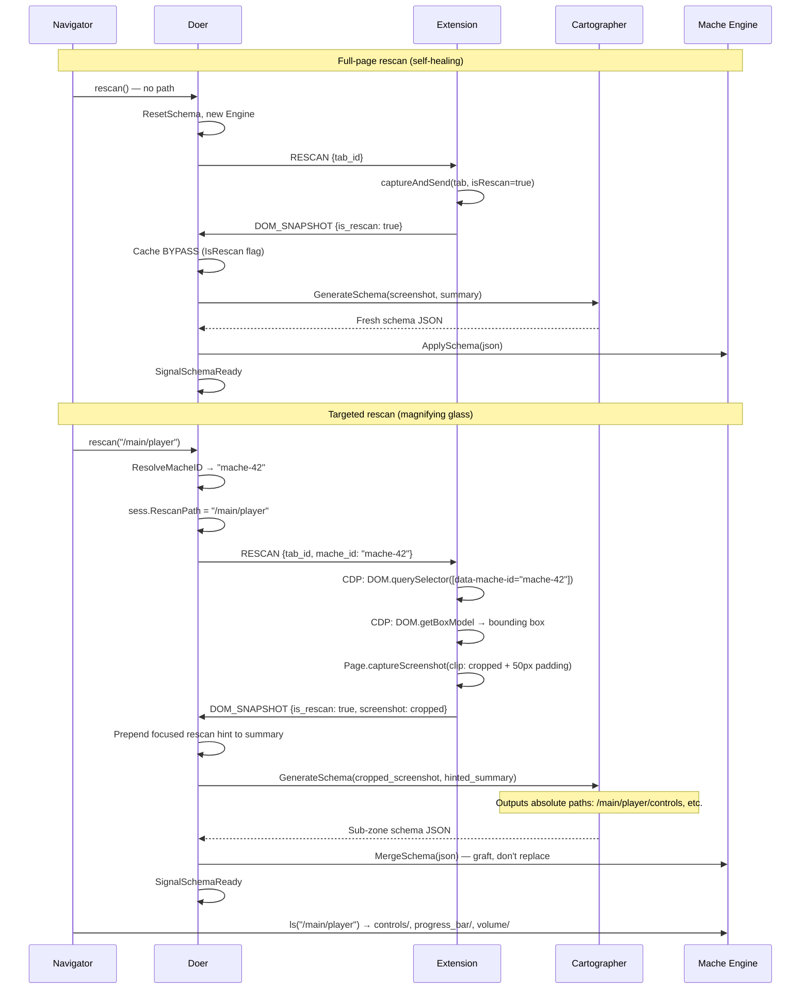

# X-Ray Architecture

## System Diagram



## Talker / Doer Swarm Architecture

The voice system splits into two concurrent agents per tab:

- **Talker** (`voice.go`): Connected to Gemini Live API. Always responsive to the user. Has 3 instant tools (no I/O, no blocking) so audio is never suppressed. Delegates all page work via `issue_command`.
- **Doer** (`doer.go`): Background goroutine running a multi-step loop. Receives goals from the Talker, dispatches actions, waits for page settle, feeds results back to the Navigator, and repeats up to 5 steps. Notifies the Talker when done.

### Multi-Step Loop (Closed-Loop Verification)

A single voice command like *"Go to HN and tell me the top story"* triggers multiple steps automatically. The Doer loop observes the state of the browser after every action to ensure determinism:

```
for step := 0; step < 5; step++ {
    Navigator.HandleIntent(enrichedIntent) → ActionResult or text
    if text → done (Navigator answered)
    dispatchAction(action)
    waitForPageSettle()     // detect same-tab nav, new tab, or in-page mutation
    enrichedIntent = buildContinuation(goal, step, action, result)
}
```

**Page settle detection** (after click/type/enter):
1. **Mutation Detection (Fast Path):** Content scripts use a `MutationObserver` to detect DOM changes. A `DOM_MUTATED` signal is sent to the Doer, which triggers an immediate `rescan()` in ~150ms.
2. **Navigation Detection:** If the URL changes, the extension's auto-snapshot fires, signaling `SchemaReady` and unblocking the loop.
3. **Cross-Tab Rebinding:** If the 2s settle timeout expires, the Doer checks `activeVoiceTab`. If it changed (click opened a new tab), the Doer **teleports** its context to the new session mid-goal.
4. **Rescan Fallback:** If neither navigation nor mutation is detected, the Doer triggers a full-page rescan to capture visual state changes (e.g., a modal opening).

**Continuation prompt**: Between steps, the Doer builds a `[CONTINUATION]` prompt that tells the Navigator what happened and asks it to **VERIFY** the previous action worked before continuing.



### Talker Tools (instant, no I/O)

| Tool | Description |
|------|-------------|
| `check_status()` | Returns Doer state: Idle, Executing (with goal + step), Done, or Failed |
| `issue_command(goal)` | Submits a natural language goal to the Doer; cancels any in-flight work |
| `cancel_task()` | Aborts the current Doer goal |

### Dynamic Tab Resolution

`resolveDoer()` in `voice.go` resolves the active voice tab at tool-call time, not at startup. When the extension connects or the user switches tabs, `activeVoiceTab` updates. Each `issue_command` call resolves the Doer for whatever tab is current at that moment, so the voice session survives tab switches without reconnecting.

## Echo Gate

The native voice daemon (`StartVoiceLoop`) uses an atomic speaking flag with a 1-second cooldown to suppress mic input while Gemini is speaking. This prevents the speaker output from being picked up by the mic and fed back to Gemini.

```
markSpeaking():
  speaking.Store(1)
  timer = AfterFunc(1000ms, func() { speaking.Store(0) })

mic goroutine:
  if speaking.Load() != 0 { drop chunk }
```

The browser voice path (`HandleVoice`) does not need an echo gate because the browser handles echo cancellation in the audio pipeline.

## CDP Page Freeze

During screenshot capture in `background.js`, page JavaScript is frozen via CDP to prevent DOM changes between overlay draw and screenshot:

```
Emulation.setScriptExecutionDisabled(true)   // freeze page JS
  → Page.captureScreenshot(clip)             // capture with overlay visible
  → Accessibility.getFullAXTree()            // AX enrichment
Emulation.setScriptExecutionDisabled(false)  // unfreeze (in finally block)
```

Content scripts run in an isolated world and are unaffected by the freeze.

## Semantic Color Overlay

The Set-of-Mark overlay in `content.js` uses semantic colors so the Cartographer can identify element types visually:

| Color | Meaning | Elements |
|-------|---------|----------|
| Blue | Links | `<a>` |
| Orange | Buttons | `<button>`, `[role="button"]` |
| Green | Inputs | `<input>`, `<textarea>`, `<select>` |
| Purple | Containers | `<main>`, `<section>`, `<article>`, `<nav>`, semantic roles |
| Red | Other | Anything else |
| Cyan | Canvas-detected | Edge-detected regions inside `<canvas>` / WebGL (cv-N IDs) |

Each element in the DOM summary includes normalized `[x, y, w, h]` bounds (coordinates divided by page dimensions) and a Color field, both of which are carried into the VFS as files under `_c/N/`.

## DOM Snapshot → Cartographer → Schema → VFS Pipeline



## Virtual Filesystem Layout

After the Cartographer maps a page and the engine loads children:

```
/
├── header/
│   └── global_nav/
│       ├── mache_id          → "mache-0"
│       └── description       → "Top navigation bar"
├── main/
│   └── story_list/
│       ├── mache_id          → "mache-15"
│       ├── description       → "List of news stories"
│       ├── children           → "[1] \"First Story Title\"\n[2] \"Second Story\"..."
│       └── _c/
│           ├── 1/
│           │   ├── mache_id  → "mache-13"
│           │   ├── tag       → "a"
│           │   ├── text      → "First Story Title"
│           │   ├── role      → "link"          (from AXRole)
│           │   ├── name      → "First Story"   (from AXName)
│           │   ├── path      → "article.w-full > h3.title > a"
│           │   ├── color     → "BLUE"
│           │   └── bounds    → "[0.100, 0.250, 0.800, 0.050]"
│           ├── 2/
│           └── ...
└── footer/
    └── links/
        ├── mache_id          → "mache-200"
        └── description       → "Footer with legal links"
```

### VFS Enrichment

Each `_c/N/` directory can contain up to 8 files, injected when the corresponding data is available in the DOM summary:

| File | Source | Description |
|------|--------|-------------|
| `mache_id` | Registry | Element's internal tracking ID |
| `tag` | DOM | HTML tag name |
| `text` | DOM | Visible text content (truncated to 60 chars) |
| `role` | CDP AXRole | Computed accessibility role (e.g., `link`, `button`, `navigation`) |
| `name` | CDP AXName | Computed accessible name |
| `path` | DOM | 2-3 level CSS breadcrumb path (e.g., `article.w-full > h3.title > a`) |
| `color` | Semantic | Color name: BLUE, ORANGE, GREEN, PURPLE, or RED |
| `bounds` | DOM | Normalized `[x, y, w, h]` coordinates relative to page dimensions |

## Schema Cache

The schema cache (`schemacache.go`) stores Cartographer output in a mache `MemoryStore` graph, persisted to SQLite via `graph.ExportSQLite` at `~/.xray/schemas.db`.

- **Key format**: `domain+path` (e.g., `www.reddit.com/r/golang`) — strips query params and fragments
- **Graph structure per entry**:
  ```
  {url_key}/
  ├── schema_json    (file: raw Cartographer JSON)
  └── cached_at      (file: unix timestamp)
  ```
- **Cache hit validation**: Every `mache_id` in the cached schema is checked against the current DOM summary. Stale entries (IDs no longer present) trigger re-generation.
- **Rescan bypass**: `is_rescan` flag skips the cache entirely for fresh screenshots.
- **Generation guard**: Each snapshot increments `schemaGen` on the session. If a newer snapshot starts processing, the stale result is discarded before caching or applying.

## Per-Tab Session Architecture



Each `TabSession` contains:
- `Engine` — in-memory VFS for that tab
- `Navigator` — agent with its own tool-use history
- `Doer` — background goroutine (created lazily on first voice session)
- `SchemaReady` — channel that unblocks when schema is applied
- `DOMMutatedCh` — channel signalled by MutationObserver for instant settle (~150ms)
- `CurrentURL` — prevents redundant goto navigation
- `CVRegions` — edge-detected canvas regions (cv-N), used for CDP pixel-click dispatch

**Session pruning**: When a tab is closed, the extension sends a `TAB_CLOSED` message. The daemon cancels the corresponding Doer context and deletes the session from memory to prevent leaks.

**Cross-tab rebinding**: When a click opens a new tab, the extension sends `TAB_ACTIVATED` which updates `activeVoiceTab`. The Doer detects this during settle detection and rebinds its `tabID` and `sess` to the new tab's session mid-goal, re-wiring Navigator callbacks via `wireNavigatorCallbacks()`. This lets multi-step workflows survive tab changes transparently.

## Dynamic CSS Selectors (Scroll Architecture)



**Key insight**: The LLM identifies *what* matters visually (story titles vs. metadata links) and synthesizes a CSS selector. The browser executes it deterministically at scroll time. Both sources are unioned -- neither the LLM's visual pass nor the CSS selector alone is reliable, but together they handle brittle selectors, lazy visual passes, SPA edge cases, and infinite scroll.

## Navigator Tools

The Navigator uses a **Tool Registry** pattern (`internal/navigator/tool.go`). Each tool is a self-contained struct implementing `Declaration()` and `Execute()`. Adding a tool requires one struct and one `Register()` call — no changes to the system prompt, execution switch, or interface definitions.

| Tool | Description |
|------|-------------|
| `ls(path)` | List directory contents in the semantic filesystem |
| `cat(path)` | Read file contents (description, children, etc.) |
| `act(path, action, payload?)` | Execute browser action: click, focus, type, enter |
| `scroll(direction)` | Scroll page, poll for new DOM content, re-evaluate CSS selectors |
| `goto(url)` | Navigate browser to URL, reset engine, wait for new schema |
| `rescan(path?)` | Full-page rescan or targeted magnifying glass (crops to zone bounding box) |
| `list_tabs()` | List all open browser tabs |
| `switch_tab(tab_id)` | Switch to an existing open tab |

- Max 8 tool-use iterations (typical: 3-4)
- Temperature 0.1
- Pre-fills a tree dump on first iteration so the model sees full filesystem structure upfront

## Voice Data Flow (Browser)



## Voice Data Flow (Native Daemon)



## Rescan Flow (Self-Healing + Magnifying Glass)



## Canvas Edge Detection (Canvas Blindspot)

Standard DOM parsing fails on `<canvas>`, WebGL, and other pixel-rendered content (Google Maps, Figma, games) where the DOM is a single opaque element. The edge detection pipeline runs server-side on the screenshot JPEG before the Cartographer call, detecting rectangular UI regions inside canvas elements.

### Pipeline (`edges.go`)

```
JPEG decode → grayscale → Gaussian blur (5×5, edge-clamped)
  → Sobel edges (gradient magnitude + direction)
  → Non-maximum suppression (thin to 1px)
  → Double threshold + hysteresis (BFS flood, thresholds 50/150)
  → Connected component flood-fill (8-connectivity)
  → Bounding boxes → merge overlapping (IoU > 0.3)
  → Filter: skip area < 400px² or > 50% image area
  → Filter: skip IoU > 0.3 with existing mache bounds
  → Assign cv-0, cv-1, ... IDs
  → Draw cyan rectangles + labels on screenshot
```

### Click Dispatch

Actions targeting `cv-N` IDs bypass the content script's `el.click()` path entirely:

1. `SendActionToExtension` resolves the cv-N region's pixel center from `sess.CVRegions`
2. `OutboundMessage` includes `pixel_x` and `pixel_y` fields
3. `background.js` intercepts the pixel coordinates and uses CDP `Input.dispatchMouseEvent` (mousePressed + mouseReleased) at the mapped viewport coordinates
4. Screenshot coordinates (scaled to 800px) are mapped back to actual viewport dimensions via `Page.getLayoutMetrics`

## WebSocket Message Types

### Inbound (extension → server)

| Message | Fields | Description |
|---------|--------|-------------|
| `DOM_SNAPSHOT` | tab_id, url, summary, screenshot, is_rescan | Full page snapshot with base64 JPEG |
| `DOM_UPDATE` | tab_id, summary, resolved_items | Post-scroll update with fresh selector results |
| `NAVIGATE` | tab_id, intent | User intent for Navigator |
| `TAB_ACTIVATED` | tab_id | Active tab changed (for voice routing) |
| `SELECTORS_RESOLVED` | tab_id, resolved_items | CSS selector evaluation results |
| `TABS_LISTED` | tabs[] | Response to LIST_TABS query |
| `VOICE_LOG` | tab_id, message | Log message from voice extension |

### Outbound (server → extension)

| Message | Fields | Description |
|---------|--------|-------------|
| `SCHEMA_READY` | tab_id, schema | Cartographer output applied |
| `EXECUTE_ACTION` | tab_id, mache_id, action, payload, pixel_x?, pixel_y? | Click/type/enter/focus on element (pixel coords for cv-N canvas clicks via CDP) |
| `SCROLL` | tab_id, direction, selectors | Scroll with CSS selectors for re-evaluation |
| `GOTO_URL` | tab_id, url | Navigate to URL |
| `RESCAN` | tab_id, mache_id? | Trigger fresh snapshot (optional zoom target) |
| `RESOLVE_SELECTORS` | tab_id, selectors | Evaluate CSS selectors in browser |
| `LIST_TABS` | (none) | Request list of all open tabs |
| `SWITCH_TAB` | tab_id | Activate a specific tab |
| `STATUS` | tab_id, message, stage | Progress/error feedback |

## Audio Formats

| Leg | Format | Sample Rate |
|-----|--------|-------------|
| Browser → Agentd | 16-bit PCM, mono | 16 kHz |
| Sox mic → Agentd (daemon) | 16-bit PCM, mono | 16 kHz |
| Agentd → Gemini Live | Same (proxied) | 16 kHz |
| Gemini Live → Agentd | 16-bit PCM, mono | 24 kHz |
| Agentd → Browser | Same (proxied) | 24 kHz |
| Agentd → Sox speaker (daemon) | 16-bit PCM, mono | 24 kHz |

## Components

### Chrome Extension (`ext/`)

Seven files, no build step, no dependencies.

- **`content.js`**: Injected into every page. Builds an in-memory element registry (zero DOM mutation -- SPA-safe, stable mache-IDs across rebuilds), draws/removes semantic color overlay (Blue=links, Orange=buttons, Green=inputs, Purple=containers, Red=other) with bounding boxes + ID labels, generates flat text summary with Color, normalized Bounds, and DOM breadcrumb Paths, executes browser actions on command, evaluates CSS selectors after scroll to resolve fresh primary items.
- **`background.js`**: Service worker. WebSocket to agentd, CDP page freeze (`Emulation.setScriptExecutionDisabled`) during screenshot capture, scaled JPEG screenshot (800px wide, q60), CDP accessibility tree capture + AX-to-mache-id mapping, per-tab schema tracking, auto-snapshot on manual navigation. Handles `RESCAN` (with optional mache_id for magnifying glass crop), `GOTO_URL`, `SCROLL`, `EXECUTE_ACTION` (with CDP pixel-click for cv-N canvas regions via `Input.dispatchMouseEvent`), `LIST_TABS`, `SWITCH_TAB`, `RESOLVE_SELECTORS`. Sends `TAB_ACTIVATED` on connect and tab switch.
- **`popup.html/js`**: Extension popup. Snapshot button, mic toggle, session kill button.
- **`offscreen.html/js`**: Persistent voice audio bridge. Mic capture (48 -> 16kHz downsample), PCM streaming, audio playback (24kHz).
- **`manifest.json`**: Manifest V3. Permissions: `activeTab`, `debugger`, `scripting`, `tabs`, `offscreen`.

### WebSocket Handler (`internal/api/`)

- Per-tab session registry (`sessions map[int]*TabSession`)
- `SchemaGenerator`, `IntentHandler`, and `ContentGenerator` interfaces decouple Cartographer/Navigator/LLM for testability
- **Schema cache**: `schemacache.go` -- mache `MemoryStore` graph persisted to SQLite (`~/.xray/schemas.db`). Keys are `domain+path`. Cache hit validates IDs against current DOM summary; stale entries trigger re-generation. Rescan bypasses cache via `IsRescan` flag.
- **Canvas edge detection**: Before the Cartographer call, `DetectCanvasRegions()` runs a pure-Go Canny pipeline (grayscale → Gaussian blur → Sobel → NMS → hysteresis → contour flood-fill) on the screenshot JPEG. Detected regions that don't overlap existing mache bounds get `cv-N` IDs, cyan overlay boxes on the screenshot, and summary entries. Actions targeting `cv-N` IDs dispatch via CDP `Input.dispatchMouseEvent` at the region's pixel center instead of DOM `el.click()`.
- **Generation counter**: Each `handleDOMSnapshot` increments `schemaGen` on the session. If a newer snapshot starts processing (e.g., double goto), the stale Cartographer result is discarded before caching or applying.
- **Voice handler**: `/voice?tab=N` -- Talker with Gemini Live, delegates work to Doer. No audio suppression needed (Talker tools are instant).
- **Voice daemon**: `StartVoiceLoop` -- native mic/speaker via sox, same Talker/Doer architecture + Google Search Grounding + echo gate.
- `POST /navigate` for curl/testing

### Cartographer (`internal/cartographer/`)

Stage 1. Screenshot + DOM summary → semantic JSON schema.

- Gemini Vision with structured output (`ResponseSchema`)
- 3-7 zones, primary items for list zones, CSS `item_selector` for dynamic resolution
- Each summary line includes DOM breadcrumb paths; Cartographer uses these to synthesize structural CSS selectors per zone
- Temperature 0.1, validation + retry on hallucination

### Navigator (`internal/navigator/`)

Stage 2. User intent → browser action via filesystem traversal.

- **`ContentGenerator` interface** (`model.go`): Abstracts the LLM call so Navigator can use Gemini, Ollama, or a mock
  - `GeminiGenerator`: Wraps `genai.Client.Models.GenerateContent()` (default)
  - `OllamaGenerator`: Talks OpenAI wire format (`/v1/chat/completions`); translates genai types <-> OpenAI messages/tools/tool_calls
  - `GemmaGenerator`: Embeds tool definitions in system prompt, parses function calls from model text output as JSON. Used when `NAVIGATOR_FORMAT=gemma`
- Eight tools: `ls`, `cat`, `act`, `scroll`, `goto`, `rescan`, `list_tabs`, `switch_tab`
- Max 8 tool-use iterations (typical: 3-4; scroll workflows use more)
- Temperature 0.1
- Returns `ActionResult{MacheID, Action, Path, Payload}` or text explanation

**Env vars for local model override:**
```
NAVIGATOR_ENDPOINT=http://localhost:11434/v1   # empty = use Gemini cloud
NAVIGATOR_MODEL=qwen2.5-coder:7b              # empty = use GEMINI_MODEL
NAVIGATOR_FORMAT=gemma                         # "gemma" = text-based JSON parsing; empty = OpenAI tool_calls
```

### Mache Engine (`internal/mache/`)

In-memory virtual filesystem from Cartographer output, backed by a mache `MemoryStore` graph.

- `ApplySchema()` -- destructive: clears store, builds fresh directory tree with `Mount.ItemSelector` for dynamic CSS selectors
- `MergeSchema()` -- non-destructive: grafts new mounts into existing filesystem. Used by targeted rescan (magnifying glass) to add sub-zones without losing existing state.
- `LoadChildren(summary, resolvedItems)` -- parent-chain zone membership, max 200 children per zone, ordinal `_c/` entries (`1/`, `2/`, ...) with enrichment files (role, name, path, color, bounds). Unions static `PrimaryItems` with browser-resolved CSS selector results (deduplicated, stale IDs filtered against current DOM summary).
- `ZoneSelectors()` -- returns `map[macheID]cssSelector` for scroll-time evaluation
- `ListDir()` / `ReadFile()` / `ResolveMacheID()` -- Navigator's tool implementations
- `ValidateSchema()` -- checks all mache_ids in schema exist in DOM summary. Used for cache validation and hallucination detection.
- `parseSummary()` handles Color, Bounds, Path, AXRole, AXName fields

## Google Cloud Services

- **Gemini 2.5 Flash** via GenAI Go SDK (`google.golang.org/genai`) -- Cartographer + Navigator (default; Navigator swappable via `ContentGenerator` interface)
- **Gemini Live API** (native audio, `v1alpha`) -- real-time voice interaction via Talker (browser `/voice` endpoint + native `--voice` daemon)
- **Google Search Grounding** -- Gemini executes searches server-side via `GoogleSearch` tool (voice mode only)
