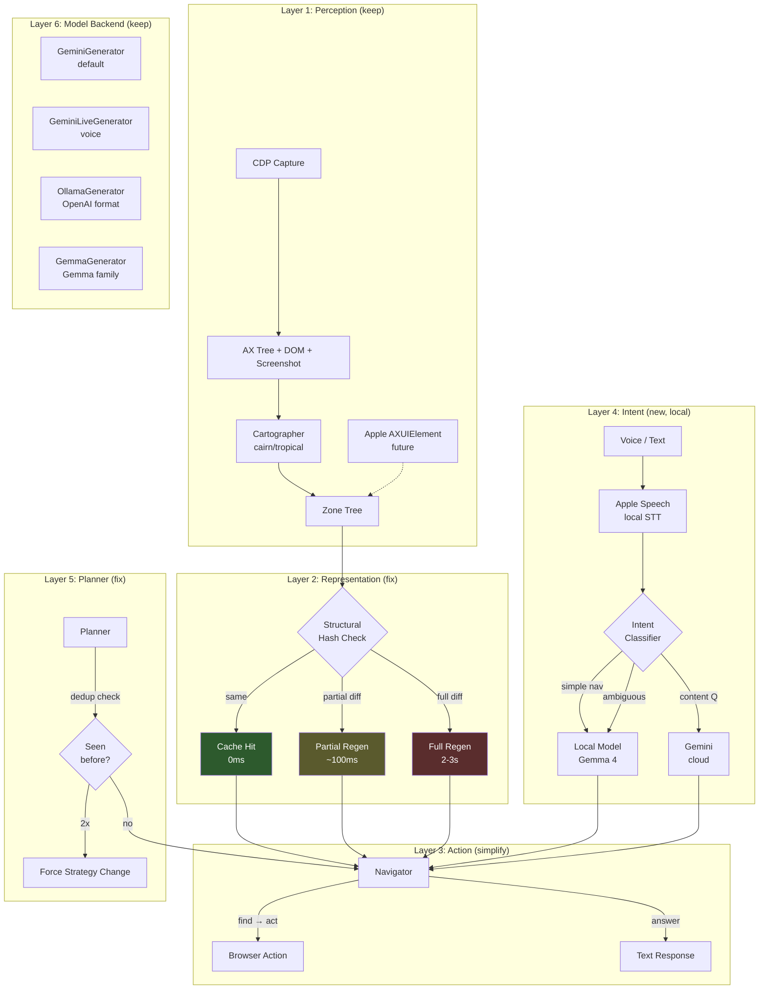
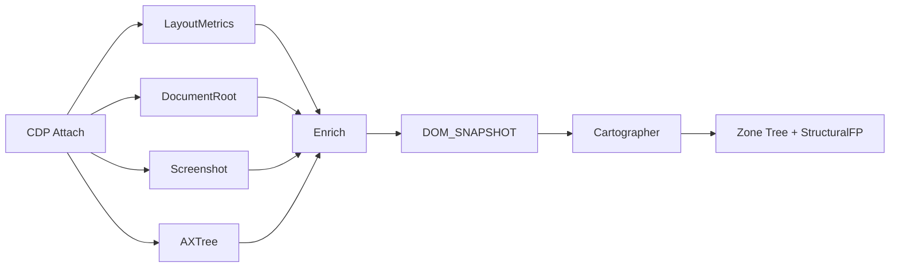
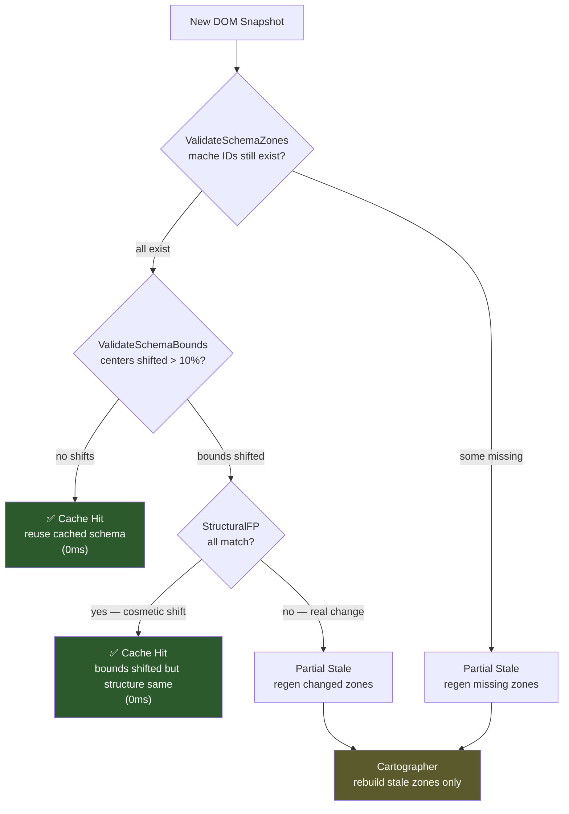
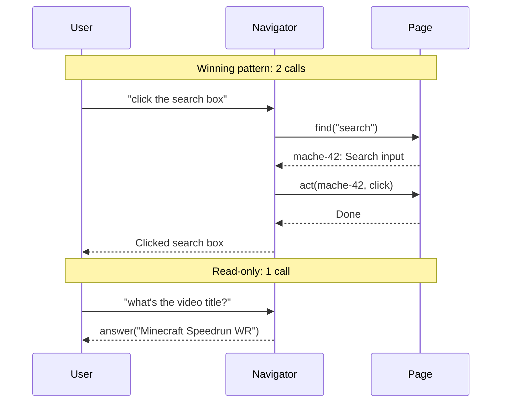
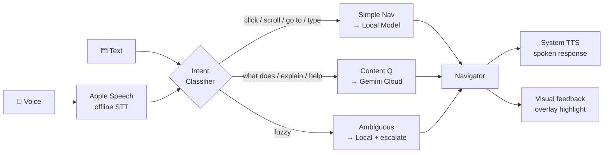
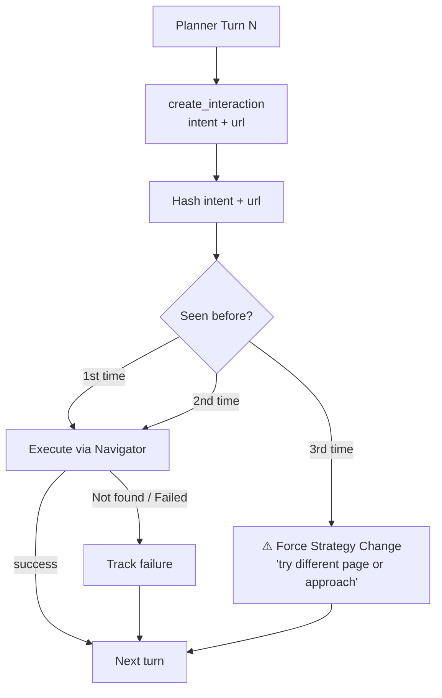

# Local-First Navigator with Algebra-as-Grounding

**Date:** 2026-04-12
**Status:** Draft

## Problem

The x-ray navigator pipeline is slow and clumsy despite having good perception (cairn/tropical segmentation). Log analysis across 10 golden loop runs, 37 navigate sessions, and 175 WebArena tasks reveals:

1. **Cache granularity too fine**: BOUNDS MISMATCH fires on minor DOM shifts (thumbnails loading, ad placement), triggering full 2-3s schema rebuilds. This accounts for 15-20% of wall time. The PARTIAL STALE path (milliseconds) exists but almost never fires.
2. **Schema timeout race**: 3s Doer timeout < 2-3s cartographer build time. 6/10 golden loop runs started the navigator with an empty tree, causing redundant `goto` + double schema builds.
3. **read_only enforcement broken**: Navigator performs clicks/types when asked to read. ~65% of failed WebArena sessions. Root cause of cascade failures.
4. **Planner loops without strategy change**: Retries identical intents with rephrased words. 100% of failed sessions. No deduplication.
5. **Empty model responses**: 25-35% of turns in failing sessions produce nothing.
6. **Too many tools**: 11 tools when the winning pattern is `grep -> act` (2 calls). Complex vocabulary increases model confusion and malformed call rate (1.9/run).
7. **Unnecessary VLM roundtrips**: Algebra already computes structure. Sending screenshots to cloud for "grounding" is redundant when cairn/tropical already identified zones.

## Design Principles

1. **Algebra first, eyes second.** Cairn/tropical gives structure (zones, roles, relationships, actionable elements). Vision is an escalation path for content understanding, not the default grounding mechanism.
2. **Local first, cloud second.** Common commands (click, scroll, navigate, search) resolve locally. Cloud handles content understanding ("explain this code") and complex multi-step reasoning.
3. **Stable representation.** Structural hashing on the zone tree. "Shape same, content changed" is a cheap diff, not a full rebuild.
4. **Simple action vocabulary.** The winning pattern is 2 tool calls. Design around that, not around 11 tools.
5. **Pluggable, not phased.** Gemini stays primary (hackathon judging April 24). Local model slides in alongside via existing ContentGenerator interface. All fixes are backend-agnostic.
6. **Don't break what works.** Every change must be additive or behind a flag. Existing Gemini path, CDP pipeline, cartographers, and extension must continue working as-is. New code paths are opt-in until validated. Tests must pass at every step.

## Target User

Four homeschooled autistic children (ages ~7+). Primary use case: voice-controlled browser navigation for learning (YouTube tutorials, Minecraft Java modding resources, eventually IDE navigation). The 7-year-old has neuropathy from treatment limiting fine motor control.

Constraints: must be fast (child attention span), forgiving (imprecise voice commands, learning to read), reliable (no debugging mid-session), and work offline for the common path.

## Architecture Overview



### Layer 1: Perception (keep as-is, it works)



No changes. The segmentation is good. Screenshot is captured but only sent to cloud when vision escalation is needed.

Future: Apple AXUIElement as additional input source alongside CDP, feeding same zone representation. This makes the system work for native apps (IDE, Minecraft launcher) not just browsers.

### Layer 2: Representation (fix cache, add structural hashing)

**Current:** Zone tree cached by URL. BOUNDS MISMATCH on any element shift -> full rebuild.

**New:** Leverage existing `StructuralFP` (already computed per-zone by cartographer) in cache decisions.



Structural hash captures the shape. Content is separate. When structural hash matches:
- SAME: skip rebuild entirely (cache hit)
- PARTIAL DIFF: regen only changed zones (the fast PARTIAL STALE path)
- FULL DIFF: full rebuild (new page, major layout change)

Bounds bucketing: quantize bounds to grid cells (e.g., 50px) so that 3px shifts from dynamic content don't flip the hash.

A "zone" for hashing is the unit produced by cairn/tropical segmentation — the same zones rendered in the overlay. Each zone has a role (header, nav, content, sidebar, etc.), bounds, children, and content. The structural hash covers role + child topology + bucketed bounds. Content (text, attributes) is tracked separately so content-only changes don't invalidate structure.

**Schema ready signal:** Replace 3s timeout with a channel/signal. Doer waits for cartographer to finish (with a generous 10s fallback timeout). No more racing.

### Layer 3: Action Model (simplify)

**Current 11 tools:** ls, cat, stat, act, grep, scroll, goto, rescan, list_tabs, switch_tab, new_window/new_tab

**New 5 tools:**

| Tool | Purpose | Maps to |
|------|---------|---------|
| `look(zone?)` | See zone contents or page overview | ls + cat (zone-scoped) |
| `find(query)` | Search for element by text/role | grep |
| `act(element, action, value?)` | Click, type, focus | act |
| `scroll(direction)` | Scroll up/down | scroll |
| `answer(text)` | Return text response (read-only queries) | text response |



The default path becomes: `find(query) -> act(element, action)`. Two calls. This matches the winning pattern from logs.

`look` is for exploration when the model needs more context. `answer` gives the model an explicit way to respond to read-only queries without forcing a tool call (fixes the malformed call pattern on "what is the title?" queries).

Tab management (goto, list_tabs, switch_tab, new_tab) moves to the Planner level — the Navigator operates within a single page context.

### Layer 4: Intent Classification (new, local)



The classifier can start as simple rules (keyword matching on "click", "scroll", "go to", "type") and graduate to Gemma 4 for fuzzy intent parsing ("go to the minecraft thing").

For voice: Apple Speech Recognition (offline, fast) -> text -> classifier. TTS for responses via system speech synthesis. Gemini Live remains available as an option but is not the default voice path.

### Layer 5: Planner (fix loops, add memory)



**Loop detection:** Hash each (intent, page_url) pair. If the same pair appears 3 times, the planner must change strategy (different action, different page, or escalate to user).

**Failed intent memory:** Track which intents returned "Not found" or errors. Don't retry the same approach — try an alternative or ask the user for help.

**read_only enforcement:** When read_only=true, the Navigator tool registry blocks `act` at both schema level (model can't see it) AND dispatch level (registry rejects the call even if model hallucinates it). Currently broken — fix it at both levels.

### Layer 6: Model Backend (pluggable, existing interface)

```go
type ContentGenerator interface {
    GenerateContent(ctx, model, history, config) (*Response, error)
}
```

Existing backends (no changes needed to interface):
- **GeminiGenerator** — cloud REST, stays primary/default
- **GeminiLiveGenerator** — cloud WebSocket, for voice sessions
- **OllamaGenerator** — OpenAI-format local models
- **GemmaGenerator** — Gemma-family local models (JSON + CLI modes)

Gemma 4 plugs in via OllamaGenerator (if it supports OpenAI tool calling format) or GemmaGenerator (if it needs the JSON/CLI parsing path). Config switch:

```yaml
navigator:
  model: "gemma-4-12b"
  endpoint: "http://localhost:11434/v1"
  format: "openai"  # or "gemma" depending on Gemma 4's tool call format
```

Default stays `gemini-2.5-flash` until explicitly switched.

## What Changes, What Stays

| Component | Status | Notes |
|-----------|--------|-------|
| CDP capture pipeline | **Keep** | Works well, Go-driven, handles reconnects |
| CairnCartographer | **Keep** | Good segmentation, sheaf folding works |
| TropicalCartographer | **Keep** | Alternative segmentation path |
| Zone cache | **Change** | Add merkle structural hashing, bounds bucketing |
| Schema wait | **Change** | Signal-based instead of 3s timeout |
| Navigator tool registry | **Change** | 11 tools -> 5 tools |
| Navigator agent loop | **Change** | Adapt for new tool vocabulary |
| read_only enforcement | **Fix** | Registry-level exclusion of act tool |
| Planner loop | **Change** | Add intent hashing, failed intent memory |
| ContentGenerator interface | **Keep** | Already pluggable |
| Gemini backend | **Keep** | Stays primary/default |
| Voice input | **Add** | Apple Speech Recognition (local STT) |
| Voice output | **Add** | System TTS for responses |
| Intent classifier | **Add** | Local, rule-based initially, Gemma 4 later |
| Apple a11y API input | **Future** | Additional provider feeding zone representation |

## Success Criteria

1. **Golden loop completes in <30s** (currently 50-70s) with correct answers
2. **Zero full schema rebuilds** on same-page interactions (currently 2-4 per run)
3. **Navigator converges in <=3 tool calls** for simple actions (currently bimodal: 2 or 20)
4. **No read_only violations** (currently ~65% of failed sessions)
5. **Planner never retries identical intent** (currently 100% of failed sessions)
6. **Voice command to action in <500ms** for simple commands (local path)
7. **Works with Gemini (default) and local model (Gemma 4) via config switch**

## Non-Goals

- Replacing Gemini as default before hackathon judging (April 24)
- Building a full tutoring/education system (that's a layer on top)
- Native app support via Apple a11y APIs (future work, but architecture should not preclude it)
- Changing the Chrome extension or CDP pipeline
