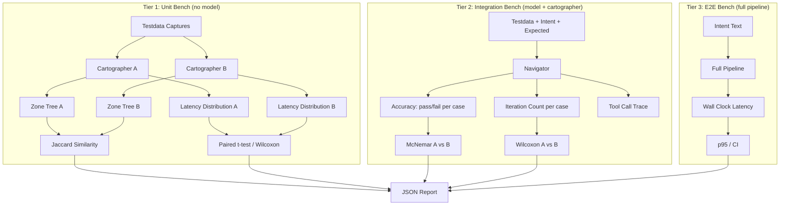
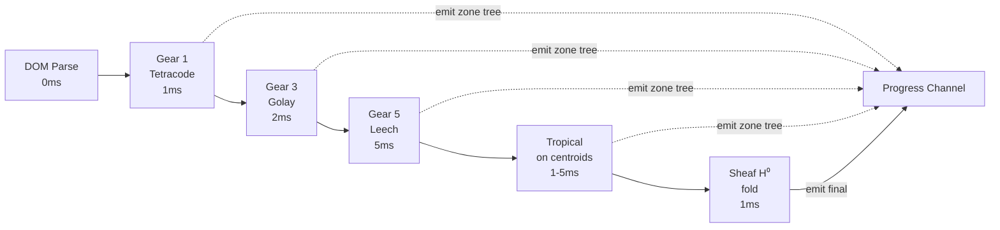

# Progressive Pipeline + Eval Harness

**Date:** 2026-04-27
**Status:** Draft
**Depends on:** 2026-04-12-local-first-navigator-design.md (phase 1 fixes — merged)

## Context

Phase 1 fixes are merged to main (cache bounds, schema timeout, read_only enforcement, planner dedup, answer tool). Gemma 4 26B-A4B validated locally via llama.cpp: 82% accuracy with thinking, 71% without, 3-8s per action. The accuracy drop without thinking reveals a representation problem — the model compensates for a confusing interface with reasoning tokens.

Three sub-projects address this. Each is independent in implementation but sequential in validation.

## Sub-Project A: Eval Harness

### Hypothesis Hierarchy

#### H1 (Unit): Progressive Cartographer Zone Quality
- **Claim**: Progressive pipeline produces zones equivalent to full cairn in <15ms
- **Prediction**: For N>=100 page captures across >=5 site categories, Jaccard similarity between progressive-final and full-cairn >0.85, with first-usable-result latency <5ms
- **Null**: Jaccard <0.7 or latency not meaningfully faster (paired t-test p>0.05)
- **Power**: N=100 cases, effect size d=0.5, alpha=0.05, power=0.80

#### H2 (Integration): Semantic Paths Reduce Iteration Count
- **Claim**: Semantic paths + 5 tools achieve >=90% accuracy in <=3 tool calls
- **Prediction**: On >=150 bench cases across >=10 site categories, pass rate >=90%, median iterations <=3
- **Null**: Accuracy does not improve (McNemar's test p>0.05) or iterations do not decrease (Wilcoxon signed-rank p>0.05)
- **Power**: N=150 paired observations for McNemar detecting 10% improvement (82%->92%), alpha=0.05, power=0.85

#### H3 (E2E): Full Local Pipeline Under 1 Second
- **Claim**: Voice->action completes in <1s for simple commands
- **Prediction**: p95 latency <1s for "simple" commands (click, scroll, goto) over N>=50 trials across >=3 sites
- **Null**: p95 >= 1s
- **Power**: N=50 trials, one-sample t-test on log-transformed latencies

### Harness Design



### Testdata Requirements

- Expand bench_cases.json to ~150 cases across ~10 site categories
- Each case: site, intent, expected_mache_id, expected_text, difficulty (simple/medium/hard)
- Frozen testdata per site: DOM summary, screenshot (PNG), AX tree snapshot
- New site categories needed: news aggregator (existing), code hosting (existing), ecommerce (existing), encyclopedia (existing), social (existing), search engine, email, video, documentation, IDE/terminal
- Fixed random seed for reproducibility

### Output Format

```json
{
  "run_id": "20260427_120000",
  "config": {"cartographer": "cairn", "model": "gemma-4-26B-A4B-it", "reasoning": "off", "tools": "12"},
  "hypotheses": {
    "H1": {"result": "pass", "jaccard_mean": 0.91, "jaccard_ci95": [0.87, 0.95], "latency_ms_p50": 8, "latency_ms_p95": 14},
    "H2": {"result": "fail", "accuracy": 0.82, "mcnemar_p": 0.12, "iterations_median": 5, "wilcoxon_p": 0.003},
    "H3": {"result": "pass", "p95_ms": 850, "p95_ci95": [720, 980]}
  },
  "raw_results": [...]
}
```

### Statistical Methods

- **Multiple comparison correction**: Bonferroni across H1-H3 (alpha = 0.05/3 = 0.017 per test)
- **Effect sizes**: Cohen's d for latency, odds ratio for accuracy
- **Confidence intervals**: 95% bootstrap CI (10000 resamples) for all primary metrics
- **Reproducibility**: 3 seeds minimum, report variance across seeds
- **Controls**: Run baseline (current system) and experimental in same harness, same data, same session

## Sub-Project B: Progressive Cartographer

### Pipeline



### Interface

```go
type ProgressiveCartographer struct {
    Progress chan<- ProgressResult
}

type ProgressResult struct {
    Stage   int    // 0=DOM, 1=Gear1, 2=Gear3, 3=Gear5, 4=Tropical, 5=Sheaf
    Schema  string // valid CartographerOutput JSON
    IsFinal bool
    Latency time.Duration
}
```

Implements existing `SchemaGenerator` interface for the final result. Intermediate results emitted via channel. Each stage runs sheaf H⁰ fold for consistency. Tropical runs on zone centroids (O(K^3) where K~20), not raw elements.

### Key Constraints

- Each stage must produce a **valid, act-able zone tree** (passes `engine.ApplySchema`)
- Gear levels operate on different subspaces (4D->12D->24D) — emit fresh tree each stage, not incremental patches
- Existing cairn/tropical cartographers remain as standalone options — progressive wraps them

## Sub-Project C: Semantic Path Projection

### Current vs New

```
Current:  mache-42                        → opaque, model must excavate
New:      /browser/header/search-input    → self-describing, model reads path
```

### Projection Rules

- Zone path encodes: `/{app}/{region}/{role}-{label}`
- Region from zone position: header, nav, main, sidebar, footer
- Role from element type: link, input, button, heading, image, text
- Label from element text (slugified, truncated to 30 chars)
- mache-ID resolved internally — model never sees it
- Collisions: append `-2`, `-3` etc.

### Tool Vocabulary (5 tools)

| Tool | Signature | Purpose |
|------|-----------|---------|
| `find` | `find(query) -> [{path, text, role}]` | Search, return ranked matches |
| `act` | `act(path, action, value?)` | Click, type, focus by semantic path |
| `scroll` | `scroll(direction)` | Scroll up/down |
| `answer` | `answer(text)` | Return text response |
| `look` | `look(zone?)` | See zone contents |

`find` returns a ranked list (not grep's flat text), so the model picks from options rather than parsing. `act` takes semantic paths, resolves to mache-ID internally.

### Backward Compatibility

- New projection is opt-in via config flag (`navigator.projection: "semantic"`)
- Default remains current mache-ID paths
- Both projections use same underlying zone tree from cartographer

## Validation Plan

Each sub-project is validated against the eval harness:

1. **Baseline**: Run harness with current system (cairn + 12 tools + mache-IDs + Gemini)
2. **Progressive only**: Swap cartographer, keep everything else. Test H1.
3. **Semantic paths only**: Keep cartographer, swap projection + tools. Test H2.
4. **Combined**: Progressive + semantic paths + Gemma 4 local. Test H1+H2+H3.
5. **Ablations**: Each component independently to isolate contributions.

## Non-Goals

- Voice/STT integration (separate project, after these validate)
- Apple AXUIElement input (architecture should not preclude it)
- Gemma 4 fine-tuning (use off-the-shelf weights)
- Modifying Chrome extension or CDP pipeline
